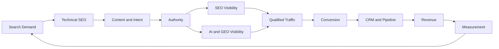

<div align="center">

# 🔎 SEO Growth Systems

### Practical Frameworks for SEO, GEO & AI Search Visibility

**Technical SEO · SaaS SEO · Local SEO · GEO · AI Search · SEO Reporting**

A public knowledge repository for building search visibility that contributes to  
**qualified demand, pipeline and revenue.**

<br>

[](seo-growth-framework.md)
[](technical-seo-audit-framework.md)
[](geo-llm-visibility-framework.md)
[](local-seo-audit-framework.md)
[](saas-seo-framework.md)

<br>

**Created and maintained by [Prashant Rajput](https://github.com/prashant6788)**  
Founder, [Touchstone Infotech](https://www.touchstoneinfotech.com/)

</div>

---

## 🧭 Start Here

New to this repository?

Start with the **[SEO Growth Framework](seo-growth-framework.md)**.

It explains the complete system for connecting search visibility with measurable business outcomes:

**Search Demand → Technical Foundation → Content → Authority → AI Visibility → Conversion → Revenue**

Then use the specialized frameworks and practical templates below depending on what you are working on.

---

# 📚 Framework Library

| | Framework | Best For |
|---|---|---|
| 🚀 | **[SEO Growth Framework](seo-growth-framework.md)** | Building an end-to-end SEO growth strategy |
| 🔧 | **[Technical SEO Audit Framework](technical-seo-audit-framework.md)** | Technical audits, crawling, indexing & architecture |
| 🤖 | **[GEO / LLM Visibility Framework](geo-llm-visibility-framework.md)** | AI visibility, entities & LLM citation readiness |
| ✅ | **[AI Search Visibility Checklist](ai-search-visibility-checklist.md)** | Auditing visibility across AI-powered discovery |
| 💻 | **[SaaS SEO Framework](saas-seo-framework.md)** | SaaS organic acquisition, product discovery & pipeline |
| 📍 | **[Local SEO Audit Framework](local-seo-audit-framework.md)** | GBP, local rankings, reviews & local authority |
| 📊 | **[SEO Reporting Framework](seo-reporting-framework.md)** | Connecting SEO with leads, CRM, pipeline & revenue |

---

# 🧰 Practical Templates

These resources are designed to be used directly during audits, reporting and implementation.

| | Template | Best For |
|---|---|---|
| 🔍 | **[SEO Audit Worksheet](seo-audit-worksheet.md)** | Running a structured website SEO audit |
| 🤖 | **[GEO / AI Prompt Testing Template](geo-prompt-testing-template.md)** | Measuring brand visibility across AI platforms |
| 📊 | **[Monthly SEO Reporting Template](monthly-seo-reporting-template.md)** | Monthly SEO, lead and revenue reporting |
| 🔧 | **[Technical SEO Issue Template](technical-seo-issue-template.md)** | Turning SEO findings into developer-ready tasks |

---

## 🧩 The SEO Growth System



The objective is not simply to increase rankings or traffic.

The objective is to create a repeatable system where **search visibility contributes to qualified business growth**.

---

## 🎯 Who This Repository Is For

These frameworks and templates are designed for:

- SEO professionals and consultants
- Founders and business owners
- Marketing and growth teams
- SaaS and technology companies
- SEO and digital marketing agencies
- Local and multi-location businesses
- Teams exploring GEO and AI-search visibility

The resources are designed for people who want to move beyond rankings and traffic toward **measurable search-driven business outcomes**.

---

# 📖 Core Frameworks

## 🚀 SEO Growth Framework

### [Open the SEO Growth Framework →](seo-growth-framework.md)

The core framework for building an end-to-end organic growth system.

It connects:

**Business Goals → Search Demand → Technical Foundation → Search Intent → Content Architecture → Authority → AI Visibility → Conversion → Revenue → Measurement**

Use this framework as the starting point before moving into specialized areas.

---

## 🔧 Technical SEO Audit Framework

### [Open the Technical SEO Audit Framework →](technical-seo-audit-framework.md)

A practical technical SEO auditing system covering:

- Crawlability
- Indexation
- Canonicals
- HTTP status codes
- Site architecture
- Internal linking
- JavaScript SEO
- Core Web Vitals
- Structured data
- International SEO
- Ecommerce technical considerations
- Website migrations
- Technical monitoring

Includes a **100-point Technical SEO Audit Checklist**.

---

## 🤖 GEO / LLM Visibility Framework

### [Open the GEO / LLM Visibility Framework →](geo-llm-visibility-framework.md)

A practical framework for building visibility across AI-powered search and discovery systems.

Covers:

- Technical accessibility
- Entity clarity
- Structured information
- Passage-level clarity
- Topical authority
- Evidence and trust
- External authority
- Citation-worthy assets
- Prompt testing
- AI citation analysis
- AI visibility measurement

Includes a **100-point GEO / LLM Visibility Audit**.

> GEO and LLM visibility are evolving disciplines. This framework focuses on technically sound, measurable practices rather than claiming guaranteed inclusion or citations in AI-generated answers.

---

## ✅ AI Search Visibility Checklist

### [Open the AI Search Visibility Checklist →](ai-search-visibility-checklist.md)

A practical checklist for evaluating how clearly a business, brand or product can be discovered and understood across AI-powered search experiences.

Areas covered include:

- Technical accessibility
- Entity understanding
- Content quality
- Structured information
- Authority
- Citation readiness
- AI visibility testing
- Measurement

Useful for evaluating visibility across evolving AI-powered discovery environments.

---

## 💻 SaaS SEO Framework

### [Open the SaaS SEO Framework →](saas-seo-framework.md)

A practical framework connecting SaaS search visibility with product discovery, qualified pipeline and revenue.

Covers:

- Product SEO
- Feature pages
- Use case pages
- Industry pages
- Integration SEO
- Comparison pages
- Alternative pages
- SaaS content architecture
- Technical SEO
- GEO and AI visibility
- Product-led growth
- Sales-led growth
- CRM attribution
- Pipeline measurement

Includes a **75-point SaaS SEO Checklist**.

---

## 📍 Local SEO Audit Framework

### [Open the Local SEO Audit Framework →](local-seo-audit-framework.md)

A practical framework for businesses competing in local search.

Covers:

- Google Business Profile
- Primary and secondary categories
- Local landing pages
- Reviews and reputation
- Citations
- Local links and authority
- Geographic rank tracking
- Service-area businesses
- Multi-location SEO
- Local AI discovery
- Conversion
- CRM attribution

Includes a **100-point Local SEO Audit**.

---

## 📊 SEO Reporting Framework

### [Open the SEO Reporting Framework →](seo-reporting-framework.md)

A practical framework for connecting SEO activity with measurable business outcomes.

Covers:

- Google Search Console
- Analytics
- Search visibility
- Rankings
- Technical SEO
- Content performance
- Authority
- GEO / AI visibility
- Lead quality
- CRM attribution
- Pipeline
- Revenue
- Executive reporting
- SEO dashboards

Includes a **100-point SEO Reporting Audit**.

---

# 🧰 Practical Templates

## 🔍 SEO Audit Worksheet

### [Open the SEO Audit Worksheet →](seo-audit-worksheet.md)

A practical worksheet for auditing:

- Technical SEO
- Search intent
- On-page SEO
- Content quality
- Authority
- GEO / AI visibility
- Local SEO
- Conversion
- Measurement
- Competitive gaps

Useful for turning an SEO audit into a prioritized action plan.

---

## 🤖 GEO / AI Search Prompt Testing Template

### [Open the GEO / AI Search Prompt Testing Template →](geo-prompt-testing-template.md)

A repeatable methodology for testing brand visibility across AI-powered discovery systems.

Covers:

- Direct brand prompts
- Category discovery
- Recommendation prompts
- Problem/solution prompts
- Comparison prompts
- Location-based prompts
- Citation analysis
- Competitor visibility
- Entity accuracy
- Prompt variation testing
- Visibility tracking over time

---

## 📊 Monthly SEO Reporting Template

### [Open the Monthly SEO Reporting Template →](monthly-seo-reporting-template.md)

A practical monthly reporting template covering:

- Search visibility
- Traffic
- Landing pages
- Conversions
- Content
- Technical SEO
- Authority
- GEO / AI visibility
- Lead quality
- CRM attribution
- Pipeline
- Revenue
- Next-month priorities

Designed to move reporting beyond rankings and traffic.

---

## 🔧 Technical SEO Issue Template

### [Open the Technical SEO Issue Template →](technical-seo-issue-template.md)

A structured issue template for turning technical SEO findings into developer-ready implementation tasks.

Useful for:

- GitHub Issues
- Jira
- ClickUp
- Asana
- Linear
- Internal technical SEO workflows

The template covers:

**Issue → Evidence → Impact → Recommended Fix → Validation → Success Criteria**

---

# 🔍 What This Repository Covers

## Traditional SEO

`Technical SEO` · `On-Page SEO` · `Search Intent` · `Keyword Research` · `Content Architecture` · `Internal Linking` · `SaaS SEO` · `Local SEO`

## GEO & AI Search

`Generative Engine Optimization` · `AI Search Visibility` · `LLM Citation Readiness` · `Entity Authority` · `Structured Information` · `AI Visibility Measurement`

## Search-to-Revenue

`Conversion` · `Lead Quality` · `CRM Attribution` · `Pipeline` · `Revenue Measurement` · `SEO Reporting`

---

# 🧠 My Approach

SEO is increasingly bigger than traditional rankings.

Businesses now need to think about discoverability across traditional search engines and emerging AI-powered discovery experiences.

My approach connects:

```text
Technical Accessibility
        ↓
Search Intent
        ↓
Useful Content
        ↓
Entity Clarity
        ↓
Authority
        ↓
Search + AI Visibility
        ↓
Qualified Traffic
        ↓
Conversion
        ↓
CRM / Pipeline
        ↓
Revenue
```

The focus is not automation, content production or rankings for their own sake.

The objective is to build **useful, technically sound and measurable search systems that contribute to business growth**.

---

# 📈 Search-to-Revenue Measurement

SEO should eventually connect with business outcomes.

```text
Search Impressions
        ↓
Organic Clicks
        ↓
Landing Pages
        ↓
Conversions
        ↓
Qualified Leads
        ↓
Opportunities
        ↓
Customers
        ↓
Revenue
```

Not every organization can measure every layer perfectly.

The goal is to move SEO measurement as close to actual business outcomes as the available data allows.

---

# 🏢 Industry Experience

My SEO and digital growth work includes experience across:

**SaaS · Real Estate · Education · Ecommerce · Local Businesses**

Different industries require different search strategies, but the underlying system remains similar:

**Demand → Discoverability → Trust → Conversion → Measurement**

---

# 👤 About the Author

## Prashant Rajput

Founder of [Touchstone Infotech](https://www.touchstoneinfotech.com/).

I work across:

**SEO/GEO · AI · Automation · CRM · Performance Marketing · System Integration**

My focus is building practical systems that connect marketing activity with measurable business outcomes.

### Experience

- **13+ years** in digital growth and technology
- **300+ businesses** supported
- Experience across **India, USA, UK, Canada & Australia**
- **₹2–3 Cr+ annual media spend** managed
- Leading a **26-person growth and technology team**

### Connect

🌐 [Touchstone Infotech](https://www.touchstoneinfotech.com/)  
💼 [LinkedIn – Prashant Rajput](https://www.linkedin.com/in/prashant6788/)  
👤 [GitHub – Prashant Rajput](https://github.com/prashant6788)

---

# 🧪 Implementation Examples

The next phase of this repository is focused on showing how the frameworks are applied in practice.

Planned examples include:

- [ ] Sanitized Technical SEO Audit Example
- [ ] GEO / AI Visibility Baseline Example
- [ ] Search-to-Revenue Reporting Example
- [ ] Local SEO Audit Example

These examples will be anonymized and designed to demonstrate methodology rather than expose confidential client information.

---

# 🗺️ Repository Roadmap

## Completed

- [x] SEO Growth Framework
- [x] Technical SEO Audit Framework
- [x] SaaS SEO Framework
- [x] Local SEO Audit Framework
- [x] GEO / LLM Visibility Framework
- [x] AI Search Visibility Checklist
- [x] SEO Reporting Framework
- [x] SEO Audit Worksheet
- [x] GEO / AI Search Prompt Testing Template
- [x] Monthly SEO Reporting Template
- [x] Technical SEO Issue Template
- [x] CONTRIBUTING.md
- [x] CC BY 4.0 License

## Potential Future Additions

- [ ] Ecommerce SEO Framework
- [ ] SEO Content Refresh Framework
- [ ] Search-to-Revenue Attribution Template
- [ ] Real implementation examples
- [ ] Practical SEO experiments and observations

The goal is **not to publish resources for volume**.

New resources should add practical value to the overall search growth system.

---

# 🤝 Contributing

Suggestions, corrections and practical implementation examples are welcome.

Please read **[CONTRIBUTING.md](CONTRIBUTING.md)** before submitting a pull request.

Useful contributions may include:

- Evidence-backed SEO observations
- Updates based on current search-engine documentation
- Technical implementation examples
- GEO / AI visibility testing methodologies
- Search measurement improvements
- Reporting and attribution approaches
- Practical implementation examples

Please avoid:

- Promotional link submissions
- Spam
- Unsupported ranking-factor claims
- Fabricated statistics
- Low-quality mass-generated content
- Irrelevant backlink requests

If you identify something that should be corrected or improved, please open an **Issue**.

---

# ⚠️ Important Note

Search engines and AI-powered discovery systems change continuously.

The frameworks in this repository are intended as **practical working systems**, not guarantees of rankings, traffic, AI citations or inclusion in generated answers.

Recommendations should be evaluated against:

- Current platform documentation
- Business context
- Technical implementation
- Available evidence
- Real-world testing

---

# 📄 License

The original frameworks, checklists and educational resources in this repository are licensed under the **Creative Commons Attribution 4.0 International (CC BY 4.0) License**.

You are free to share and adapt the material, including for commercial purposes, provided appropriate attribution is given.

**Suggested attribution:**

> SEO Growth Systems by Prashant Rajput  
> https://github.com/prashant6788/seo-growth-systems

See the [LICENSE](LICENSE) file for full license terms.

---

<div align="center">

### SEO Growth Systems

**SEO · GEO · AI Search Visibility · Measurement**

Maintained by **[Prashant Rajput](https://github.com/prashant6788)**  
Founder, **[Touchstone Infotech](https://www.touchstoneinfotech.com/)**

[LinkedIn](https://www.linkedin.com/in/prashant6788/) · [GitHub](https://github.com/prashant6788) · [Touchstone Infotech](https://www.touchstoneinfotech.com/)

</div>
