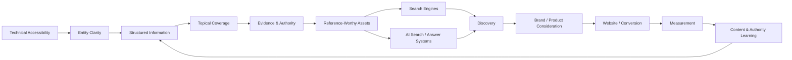
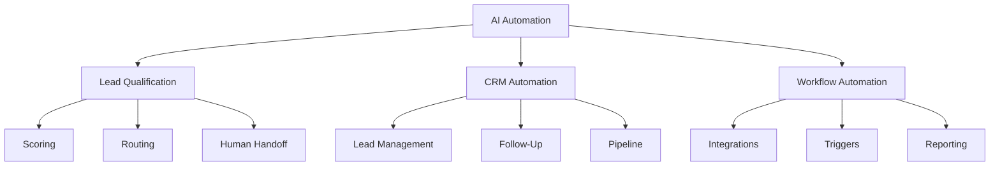
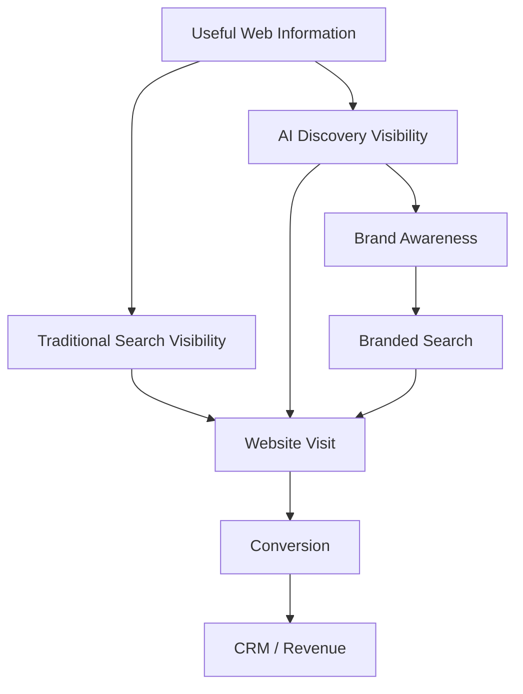

# GEO / LLM Visibility Framework

### A Practical Framework for Building Visibility, Understanding and Citation Readiness Across AI-Powered Discovery Systems

Generative Engine Optimization (GEO) and LLM visibility focus on how businesses, brands, products, experts and information are **discovered, understood, evaluated and referenced** within AI-powered search and answer experiences.

This does not replace traditional SEO.

A stronger approach connects:

**Technical SEO + Content Quality + Entity Clarity + Authority + Structured Information + Original Evidence + AI Visibility Measurement**

> Maintained by [Prashant Rajput](https://github.com/prashant6788)  
> Founder, [Touchstone Infotech](https://www.touchstoneinfotech.com/)

---

## 1. Objective

A GEO / LLM visibility program should help answer:

- Can AI-powered discovery systems access important information about the business?
- Is it clear who the organization is and what it does?
- Are products, services, people and locations represented consistently?
- Can important claims be verified?
- Does the website provide clear answers to relevant customer questions?
- Is information structured so individual passages remain understandable?
- Does the brand have authority beyond its own website?
- Does it publish original information worth referencing?
- Is important information current?
- Does the brand appear for relevant AI prompts?
- Which sources are cited when the brand does or does not appear?
- Can AI visibility be connected to business outcomes?

The goal is:

**Accessible → Understandable → Credible → Reference-Worthy → Discoverable → Measurable**

---

## 2. GEO / LLM Visibility Architecture



GEO should be treated as a visibility system, not as a single content-writing technique.

---

# Part I — Understand the AI Discovery Market

## 3. Define the Entity

Before optimizing for AI visibility, define what needs to be understood.

Possible entities include:

- Company
- Brand
- Founder
- Expert
- Product
- Software
- Service
- Location
- Organization
- Publication

Document:

```text
Entity Name
Entity Type
Primary Category
Products / Services
Target Customers
Industries
Locations
Key People
Credentials
Official Website
Authoritative Profiles
Important Relationships
```

Consistency helps reduce ambiguity.

---

## 4. Define the Prompt Market

Traditional SEO begins with search demand.

GEO should also examine the **questions and prompts customers may ask AI systems**.

Examples:

```text
What are the best CRM automation platforms for clinics?

How can a real estate company automate lead follow-up?

Which SEO agencies specialize in AI search visibility?

What should I look for in a local SEO provider?

What are alternatives to [product]?

How does AI lead qualification work?
```

Prompt research should reflect actual customer decisions rather than arbitrary prompt lists.

---

## 5. Prompt Categories

Useful categories include:

### Category Discovery

```text
best CRM platforms for clinics
top SEO tools for SaaS
```

### Problem Solving

```text
how to reduce missed leads
how to automate customer follow-up
```

### Product / Vendor Discovery

```text
companies that provide AI lead automation
agencies specializing in GEO
```

### Comparison

```text
Product A vs Product B
best alternatives to Product A
```

### Recommendation

```text
which platform is best for...
which agency should I use for...
```

### Educational

```text
what is GEO
how does lead scoring work
```

### Local

```text
best clinic near me
SEO agency in New Delhi
```

### Brand Validation

```text
what does Company X do
is Company X suitable for SaaS SEO
```

---

# Part II — Technical Accessibility

## 6. Crawl & Access

Important information should be publicly accessible where the business intends it to be discoverable.

Review:

- Robots.txt
- Meta robots
- X-Robots-Tag
- Authentication
- JavaScript rendering
- Internal links
- XML sitemaps
- Status codes
- Canonicals
- Persistent URLs

Do not assume every AI system uses the same crawler, index or retrieval mechanism.

---

## 7. Rendered Content

Critical information should not depend unnecessarily on complex interactions.

Check whether important content appears in:

- Server response
- Rendered HTML
- Crawlable page structure
- Accessible text
- Stable URLs

Important information may include:

- Product descriptions
- Service details
- Pricing
- Features
- Author information
- Company identity
- Research
- FAQs
- Documentation

---

## 8. Technical SEO Foundation

GEO should build on sound technical SEO.

Review:

```text
Discovery
↓
Crawlability
↓
Rendering
↓
Indexability
↓
Canonicalization
↓
Architecture
↓
Internal Linking
```

For a complete technical process, use the [Technical SEO Audit Framework](technical-seo-audit-framework.md).

---

# Part III — Entity Clarity

## 9. Entity Definition

A website should make it easy to answer:

> Who or what is this?

For an organization:

```text
Name
↓
Category
↓
Products / Services
↓
Industries
↓
Locations
↓
People
↓
Credentials
↓
External References
```

Avoid inconsistent descriptions across important pages and profiles.

---

## 10. About Page

A useful About page can establish:

- Legal/business identity where appropriate
- Brand name
- History
- Leadership
- Expertise
- Locations
- Markets served
- Credentials
- Partnerships
- Contact information
- Links to relevant profiles

The purpose is not keyword density.

It is entity clarity and trust.

---

## 11. Author & Expert Entities

For expert-led content, provide useful authorship information.

Consider:

- Full name
- Role
- Expertise
- Experience
- Credentials
- Author archive
- Relevant professional profiles
- Other published work

The strength of an author page comes from real expertise, not schema markup alone.

---

## 12. Product & Service Entities

Clearly define:

```text
What is it?
Who is it for?
What problem does it solve?
How does it work?
What features/capabilities exist?
What does it integrate with?
What are the limitations?
How can someone buy/use it?
```

Avoid making AI systems infer core product information from vague marketing language.

---

# Part IV — Structured Information

## 13. Information Architecture

Important topics should exist within a coherent structure.

Example:



Clear relationships help users and machines interpret context.

---

## 14. Passage-Level Clarity

AI retrieval may surface individual passages rather than entire pages.

A useful section should remain understandable when read in isolation.

Prefer:

```text
## What Is Lead Routing?

Lead routing is the process of assigning an incoming lead to the most appropriate salesperson, team or workflow based on defined criteria such as territory, service, priority or availability.
```

over vague references such as:

```text
## How It Works

It makes everything more efficient.
```

Context matters.

---

## 15. Answer-First Structure

For questions, provide a direct answer before expanding.

Example:

```text
Question
↓
Direct Answer
↓
Explanation
↓
Example
↓
Evidence
↓
Limitations
↓
Related Information
```

This benefits users as well as machine retrieval.

---

## 16. Tables & Lists

Use structured formats when they genuinely improve understanding.

Good candidates:

- Comparisons
- Feature matrices
- Pricing
- Requirements
- Steps
- Definitions
- Benchmarks
- Checklists

Do not convert every paragraph into a list merely for AI optimization.

---

## 17. Definitions

Define important proprietary or industry terminology explicitly.

Example:

> **Lead routing** is the process of assigning an incoming lead to an appropriate salesperson, team or workflow using defined business rules.

Definitions reduce ambiguity and improve passage clarity.

---

# Part V — Structured Data

## 18. Schema Markup

Relevant structured data may include:

- Organization
- Person
- Product
- SoftwareApplication
- Article
- BreadcrumbList
- LocalBusiness
- Event
- VideoObject

Structured data should:

- Match visible content
- Use accurate properties
- Avoid unsupported claims
- Remain consistent with canonical pages

Schema helps describe information but does not substitute for authority or useful content.

---

## 19. Entity Relationships

Where appropriate, make relationships explicit.

Example:

```text
Organization
    ↓
Founder / Employees
    ↓
Products / Services
    ↓
Articles / Research
    ↓
Locations / Profiles
```

These relationships should be supported by real page content.

---

# Part VI — Topical Authority

## 20. Topic Coverage

A business should demonstrate useful depth around topics central to its expertise.

For example:

```text
CRM Automation
├── Lead Capture
├── Lead Qualification
├── Lead Scoring
├── Lead Routing
├── Follow-Up
├── Pipeline Management
├── Reporting
└── Integrations
```

Depth should come from useful coverage, not from producing large numbers of repetitive articles.

---

## 21. Topic-to-Product Connection

Educational content should connect naturally to the organization's actual expertise.

Example:

```text
Educational Framework
      ↓
Practical Implementation
      ↓
Relevant Product / Service
      ↓
Case Study / Evidence
```

This creates a stronger knowledge and commercial ecosystem.

---

## 22. Internal Linking

Use internal links to clarify relationships between:

- Definitions
- Frameworks
- Product pages
- Service pages
- Research
- Case studies
- Authors
- Related topics

Descriptive anchor text is more useful than repeated generic links such as "click here."

---

# Part VII — Evidence & Trust

## 23. Verifiable Claims

Important claims should be supportable.

Examples:

```text
Performance Claims
Customer Numbers
Certifications
Awards
Research Findings
Pricing
Product Capabilities
Partnerships
Experience
```

Where useful, provide the source, methodology or context.

Unsupported claims reduce credibility.

---

## 24. First-Party Evidence

Useful evidence may include:

- Case studies
- Product screenshots
- Original research
- Benchmarks
- Customer examples
- Methodologies
- Experiments
- Implementation frameworks
- Public documentation

First-party evidence can differentiate the brand from generic summaries.

---

## 25. External Evidence

External sources can reinforce entity credibility.

Examples:

- Industry publications
- Partner websites
- Professional directories
- Reputable media
- Conferences
- Associations
- Research citations
- Customer websites
- Marketplace profiles

The objective is not to manufacture mentions.

It is to create a credible external information footprint.

---

# Part VIII — Citation-Worthy Content

## 26. What Makes Content Reference-Worthy?

Content is more likely to deserve references when it offers something difficult to replace.

Examples:

- Original statistics
- Proprietary datasets
- Industry benchmarks
- Unique frameworks
- Calculators
- Checklists
- Research
- Surveys
- Experiments
- Technical documentation
- Expert analysis
- Detailed comparisons

A useful principle:

> **Publish information that improves an answer, not simply information that repeats what is already available.**

---

## 27. Original Research Framework

A basic research asset can follow:

```text
Question
↓
Methodology
↓
Dataset / Sample
↓
Findings
↓
Interpretation
↓
Limitations
↓
Source / Update Date
```

Transparency improves usefulness and credibility.

---

## 28. Public Frameworks

Publishing reusable frameworks can help establish expertise.

Examples:

```text
SEO Audit Framework
AI Visibility Checklist
Lead Qualification Framework
CRM Routing Framework
Implementation Checklist
```

Useful frameworks can earn:

- Links
- Mentions
- Social references
- Community discussion
- AI citations

---

# Part IX — Brand & External Authority

## 29. Consistent Brand Footprint

Review whether important external profiles consistently communicate:

- Brand name
- Website
- Category
- Description
- Location
- Leadership
- Products/services

Relevant sources may include:

- LinkedIn
- GitHub
- Industry directories
- Partner pages
- Review platforms
- Business profiles
- Media profiles

Consistency does not require identical wording everywhere.

---

## 30. Digital PR for GEO

Digital PR can improve both human and machine discoverability.

Potential assets:

- Original data
- Expert commentary
- Industry reports
- Predictions
- Public tools
- Research
- Case studies

Aim for credible editorial coverage rather than mass-distributed low-value mentions.

---

## 31. Community Presence

Useful participation in relevant communities may create additional signals and references.

Examples:

- GitHub
- Industry forums
- Professional communities
- Q&A platforms
- Relevant Reddit communities
- Developer ecosystems

Participation should provide genuine value.

Do not spam communities with promotional links.

---

# Part X — Platform Testing

## 32. Build a Prompt Test Set

Create a stable set of prompts representing the customer journey.

Example:

```text
Category:
What are the best CRM automation tools for clinics?

Problem:
How can a clinic automate missed enquiry follow-up?

Comparison:
What are alternatives to [competitor]?

Vendor:
Which companies offer AI-powered CRM automation in India?

Educational:
How does AI lead qualification work?
```

Track the same core prompts over time.

---

## 33. Platforms to Monitor

Depending on the target market, monitoring may include AI-powered experiences such as:

- Google AI experiences
- ChatGPT
- Gemini
- Perplexity
- Microsoft Copilot
- Other relevant answer or discovery platforms

Platform behavior changes frequently.

Do not assume visibility on one system predicts visibility on another.

---

## 34. What to Record

For each test:

```text
Date
Platform
Prompt
Brand Mentioned?
Position / Context
Linked / Cited?
Cited Source
Competitors Mentioned
Answer Theme
Accuracy
Follow-Up Behavior
```

This creates a repeatable visibility dataset.

---

## 35. Citation Analysis

When a competitor is cited and your brand is not, ask:

- Which source was used?
- What information did that source provide?
- Does your site answer the same question?
- Is your information more or less specific?
- Does the competitor have stronger external authority?
- Is there original evidence?
- Is your page accessible?
- Is the entity clear?

The goal is to understand the information gap, not merely copy the cited page.

---

# Part XI — Measurement

## 36. GEO Measurement Model

AI visibility is less standardized than traditional search measurement.

Use multiple indicators.

### Visibility

- Brand mention rate
- Product mention rate
- Category association
- Prompt coverage

### Citation

- Citation/link rate
- Pages cited
- Third-party sources cited
- Competitor citation share

### Accuracy

- Correct company description
- Correct product description
- Correct pricing
- Correct locations
- Correct features

### Traffic

- Referral visits where identifiable
- Landing pages
- Engagement
- Conversions

### Business Outcomes

- Leads mentioning AI discovery
- Demo requests
- Assisted conversions
- Pipeline
- Revenue where attributable

---

## 37. Prompt Visibility Score

A simple internal model:

```text
Total Priority Prompts: 50
Brand Mentioned: 20
Brand Cited/Linked: 8
Accurate Mentions: 18
```

Possible internal metrics:

```text
Mention Rate = Mentioned Prompts / Tested Prompts
Citation Rate = Cited Prompts / Tested Prompts
Accuracy Rate = Accurate Mentions / Brand Mentions
```

These are internal tracking metrics, not standardized industry ranking factors.

---

## 38. Weighted Prompt Score

Not all prompts have equal business importance.

Example:

| Prompt Type | Weight |
|---|---:|
| Vendor / Recommendation | 5 |
| Comparison | 5 |
| Category | 4 |
| Use Case | 4 |
| Problem | 3 |
| Educational | 2 |

A weighted model can help prioritize commercially meaningful visibility.

---

# Part XII — GEO + SEO

## 39. Shared Foundation

Traditional SEO and GEO overlap heavily.

Both benefit from:

- Crawlability
- Useful content
- Entity clarity
- Internal linking
- Authority
- Original information
- Structured data
- Brand credibility

GEO should not be treated as a reason to abandon proven SEO fundamentals.

---

## 40. Search-to-AI Discovery Model



AI visibility may influence customer behavior even when a direct referral is not visible.

---

# Part XIII — GEO by Business Model

## 41. SaaS

Prioritize clarity around:

- Product category
- Features
- Integrations
- Pricing
- Comparisons
- Use cases
- Documentation
- Security
- Customer evidence

---

## 42. Local Businesses

Prioritize:

- Business identity
- Location
- Services
- Reviews
- Hours
- Credentials
- Local authority
- Google Business Profile
- Contact/booking information

---

## 43. Ecommerce

Prioritize:

- Product identity
- Specifications
- Availability
- Pricing
- Merchant information
- Reviews
- Comparisons
- Product schema
- Buying guides

---

## 44. Professional Services

Prioritize:

- Expertise
- Practitioner identity
- Credentials
- Services
- Jurisdiction/location
- Case experience where appropriate
- Educational authority
- Contact information

For regulated industries, avoid unsupported or inappropriate claims.

---

# Part XIV — Content Refresh

## 45. Information Freshness

Review content that can become outdated:

- Pricing
- Product features
- Statistics
- Regulations
- Market data
- Team information
- Locations
- Integration capabilities
- Platform instructions

Display update context where it genuinely helps users.

Do not change dates merely to create artificial freshness.

---

## 46. Contradictory Information

Search the website and external profiles for conflicting facts.

Examples:

```text
Different Pricing
Different Company Description
Old Phone Number
Old Address
Old Product Name
Different Feature Claims
```

Resolve important contradictions at the source.

---

# Part XV — Governance

## 47. AI Visibility Governance

Assign ownership for:

- Entity information
- Product facts
- Pricing
- Author profiles
- Research
- Structured data
- External profiles
- Prompt monitoring
- Content updates

GEO becomes difficult when no team owns factual consistency.

---

## 48. Source of Truth

Define authoritative internal sources.

Example:

```text
Product Features → Product Documentation
Pricing → Pricing Page
Company Identity → About Page
Locations → Location Pages
Credentials → Author / Company Profiles
Research → Original Study
```

This reduces contradictions across the web presence.

---

# Part XVI — 90-Day GEO Implementation Plan

## 49. Days 1–30 — Baseline

Audit:

- Technical accessibility
- Entity clarity
- Product/service clarity
- Structured data
- Existing authority
- Important external profiles
- Prompt visibility
- Competitor citations
- AI referral traffic where measurable

Outputs:

```text
Entity Map
Prompt Test Set
Visibility Baseline
Citation Source List
Content Gap Map
Technical Issues
Authority Gaps
```

---

## 50. Days 31–60 — Build

Prioritize:

- Entity pages
- Product/service clarity
- Author profiles
- Structured information
- Direct-answer sections
- Topic gaps
- Internal linking
- Structured data
- Existing content improvements
- External profile consistency

---

## 51. Days 61–90 — Authority & Measurement

Build:

- Original assets
- Public frameworks
- Research
- Case studies
- Digital PR
- Relevant partnerships
- Citation opportunities

Then retest the prompt set and compare:

```text
Baseline
vs
Current Mentions
vs
Current Citations
vs
Competitors
```

Use the findings to plan the next quarter.

---

# Part XVII — 100-Point GEO / LLM Visibility Audit

## 52. Technical Accessibility

- [ ] 1. Important pages are publicly accessible
- [ ] 2. Robots.txt is reviewed
- [ ] 3. Important pages are crawlable
- [ ] 4. Important pages are indexable
- [ ] 5. Canonicals are correct
- [ ] 6. XML sitemaps are maintained
- [ ] 7. Important content renders correctly
- [ ] 8. Internal links expose priority content
- [ ] 9. Important URLs are stable
- [ ] 10. Major technical errors are monitored

## Entity Clarity

- [ ] 11. Organization name is consistent
- [ ] 12. Business category is explicit
- [ ] 13. Products/services are clearly defined
- [ ] 14. Target customers are understandable
- [ ] 15. Locations are clear
- [ ] 16. Leadership is documented
- [ ] 17. Author identities are clear
- [ ] 18. Credentials are supportable
- [ ] 19. Important relationships are explicit
- [ ] 20. External profiles align with the entity

## Content Structure

- [ ] 21. Important questions have clear answers
- [ ] 22. Headings are descriptive
- [ ] 23. Sections make sense independently
- [ ] 24. Definitions are explicit
- [ ] 25. Tables are used where helpful
- [ ] 26. Lists are used where helpful
- [ ] 27. Comparisons are structured
- [ ] 28. Important claims include context
- [ ] 29. Terminology is consistent
- [ ] 30. Content avoids unnecessary ambiguity

## Topical Authority

- [ ] 31. Core topics are documented
- [ ] 32. Subtopics are mapped
- [ ] 33. Important customer questions are covered
- [ ] 34. Commercial topics are covered
- [ ] 35. Educational topics are covered
- [ ] 36. Content gaps are identified
- [ ] 37. Internal linking supports topic relationships
- [ ] 38. Thin repetitive content is controlled
- [ ] 39. Expert knowledge is visible
- [ ] 40. Content architecture reflects real expertise

## Evidence & Trust

- [ ] 41. Major claims are verifiable
- [ ] 42. Case studies exist where appropriate
- [ ] 43. Customer evidence exists
- [ ] 44. Methodologies are explained
- [ ] 45. Research sources are cited
- [ ] 46. Original evidence is published
- [ ] 47. Limitations are disclosed where useful
- [ ] 48. Authors are identified
- [ ] 49. Company information is transparent
- [ ] 50. Unsupported claims are avoided

## Structured Data

- [ ] 51. Organization schema is reviewed
- [ ] 52. Person schema is reviewed where appropriate
- [ ] 53. Product/software schema is reviewed where relevant
- [ ] 54. Article schema is reviewed
- [ ] 55. Breadcrumb schema is reviewed
- [ ] 56. LocalBusiness schema is reviewed where relevant
- [ ] 57. Structured data matches visible content
- [ ] 58. Entity relationships are consistent
- [ ] 59. Schema errors are monitored
- [ ] 60. Misleading markup is absent

## External Authority

- [ ] 61. Important industry profiles exist
- [ ] 62. Professional profiles are accurate
- [ ] 63. Partner profiles are accurate
- [ ] 64. Relevant directory profiles are accurate
- [ ] 65. Brand mentions are monitored
- [ ] 66. Relevant backlinks are monitored
- [ ] 67. Digital PR opportunities are identified
- [ ] 68. Community participation is useful
- [ ] 69. External facts are consistent
- [ ] 70. Low-quality authority manipulation is avoided

## Reference-Worthy Assets

- [ ] 71. Original research opportunities are identified
- [ ] 72. Proprietary data is considered
- [ ] 73. Frameworks are published
- [ ] 74. Checklists/templates are published
- [ ] 75. Case studies are useful
- [ ] 76. Technical documentation is accessible
- [ ] 77. Comparative resources are credible
- [ ] 78. Assets have persistent URLs
- [ ] 79. Assets are internally linked
- [ ] 80. Important assets are kept current

## AI Visibility Testing

- [ ] 81. Priority prompts are documented
- [ ] 82. Prompts represent customer journeys
- [ ] 83. Category prompts are tested
- [ ] 84. Problem prompts are tested
- [ ] 85. Recommendation prompts are tested
- [ ] 86. Comparison prompts are tested
- [ ] 87. Brand prompts are tested
- [ ] 88. Competitor mentions are recorded
- [ ] 89. Citation sources are recorded
- [ ] 90. Answer accuracy is reviewed

## Measurement & Governance

- [ ] 91. Mention rate is tracked
- [ ] 92. Citation rate is tracked
- [ ] 93. Accuracy is tracked
- [ ] 94. AI referral traffic is reviewed where identifiable
- [ ] 95. AI-assisted conversions are investigated
- [ ] 96. Prompt tests are repeated consistently
- [ ] 97. Entity information has an owner
- [ ] 98. Product/company facts have a source of truth
- [ ] 99. Important content has a refresh process
- [ ] 100. GEO activity is connected to business outcomes

---

# Part XVIII — GEO Visibility Score

## 53. Five-Layer Scoring Model

Score each layer from **0 to 20**.

### Layer 1 — Accessible

Technical accessibility and discovery.

### Layer 2 — Understandable

Entity clarity and structured information.

### Layer 3 — Authoritative

Evidence, expertise and external authority.

### Layer 4 — Reference-Worthy

Original information and useful assets.

### Layer 5 — Measurable

Prompt testing, citations, traffic and business outcomes.

```text
Accessible         /20
Understandable     /20
Authoritative      /20
Reference-Worthy   /20
Measurable         /20
-----------------------
Total              /100
```

Suggested interpretation:

| Score | Status |
|---|---|
| 0–39 | Weak AI Visibility Foundation |
| 40–59 | Basic Foundation |
| 60–79 | Strong Discovery Foundation |
| 80–89 | Advanced GEO Program |
| 90–100 | Mature AI Visibility System |

This is an internal assessment framework, not an official score used by an AI platform.

---

# Part XIX — Common GEO Mistakes

## 54. Treating GEO as Keyword Stuffing for AI

Repeating phrases does not create authority or citation value.

---

## 55. Creating Hundreds of AI-Generated Articles

Volume without differentiation can increase noise rather than authority.

---

## 56. Ignoring Traditional SEO

AI discovery still benefits from technically accessible, authoritative web information.

---

## 57. Adding Schema Without Evidence

Structured data cannot make unsupported claims credible.

---

## 58. Tracking Only Brand Mentions

A mention may be inaccurate, negative, irrelevant or unsupported.

Track context and accuracy.

---

## 59. Optimizing for One AI Platform

Different systems use different retrieval methods, sources and models.

Build a strong web information ecosystem rather than exploiting one interface.

---

## 60. Copying Cited Competitors

The better question is why the competitor or source was useful enough to reference.

Build something more useful or more authoritative.

---

## 61. Ignoring External Sources

AI systems may rely on third-party information when understanding a company.

Your own website is only one part of the information environment.

---

## 62. Inventing Statistics for Citation

Fabricated numbers damage trust.

Original data should have a defensible methodology.

---

# Part XX — GEO / LLM Visibility System

## 63. Seven-Layer Framework

### 1. Access

Make important information technically discoverable.

### 2. Entity

Clearly define the company, people, products and services.

### 3. Structure

Organize information into understandable topics and passages.

### 4. Evidence

Support important claims with real expertise and proof.

### 5. Authority

Build credible recognition beyond owned channels.

### 6. Reference Value

Publish information worth citing.

### 7. Measurement

Track prompts, mentions, citations, accuracy and outcomes.

The complete model is:

**Access → Entity → Structure → Evidence → Authority → Reference Value → Measurement**

---

## Final Principle

GEO should not be reduced to:

> Write content in a format that AI systems like.

A stronger approach is:

> **Build the clearest, most credible, technically accessible and reference-worthy information ecosystem around the entities and topics that matter to the business.**

Strong GEO / LLM visibility combines:

**Technical SEO + Entity Clarity + Structured Information + Topical Authority + Evidence + External Authority + Original Assets + Measurement**

---

## Related Resources

### AI Search Visibility Checklist

[AI Search Visibility Checklist](ai-search-visibility-checklist.md)

A practical checklist for evaluating AI-search and citation readiness.

### SEO Growth Framework

[SEO Growth Framework](seo-growth-framework.md)

A broader framework connecting traditional search visibility, authority, conversion and revenue.

### Technical SEO Audit Framework

[Technical SEO Audit Framework](technical-seo-audit-framework.md)

A 100-point technical SEO framework covering crawling, rendering, indexation, architecture and performance.

### SaaS SEO Framework

[SaaS SEO Framework](saas-seo-framework.md)

A practical framework for building SaaS product discovery, organic pipeline and AI visibility.

### Local SEO Audit Framework

[Local SEO Audit Framework](local-seo-audit-framework.md)

A 100-point framework for Google Business Profile, local rankings, reviews, citations and local conversion.

---

## About the Author

**Prashant Rajput** is the Founder of [Touchstone Infotech](https://www.touchstoneinfotech.com/).

He works across **SEO/GEO, AI, automation, CRM, performance marketing and system integration**, building practical systems that connect visibility, acquisition and revenue operations.

- 13+ years in digital growth and technology
- 300+ businesses supported
- Experience across India, USA, UK, Canada & Australia
- ₹2–3 Cr+ annual media spend managed
- Leading a 26-person growth and technology team

Connect:

- [LinkedIn](https://www.linkedin.com/in/prashant6788/)
- [GitHub](https://github.com/prashant6788)
- [Touchstone Infotech](https://www.touchstoneinfotech.com/)

---

## Contributing

Suggestions, experiments, prompt-testing methodologies and practical implementation examples are welcome.

If you have experience with GEO, AI search visibility, entity optimization, LLM citations or AI discovery measurement, consider opening an Issue with observations or proposed improvements.

---

## Disclaimer

This framework is intended for educational and implementation-planning purposes.

AI search, generative answer systems, retrieval methods, crawler behavior and citation mechanisms change frequently and differ by platform. No framework can guarantee inclusion, recommendation, citation or ranking within an AI-generated response.

Recommendations should be tested against the current behavior and documentation of the relevant search and AI platforms.
