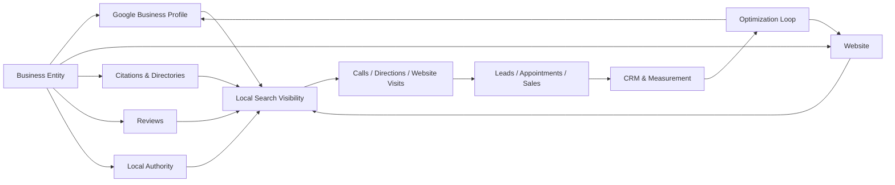
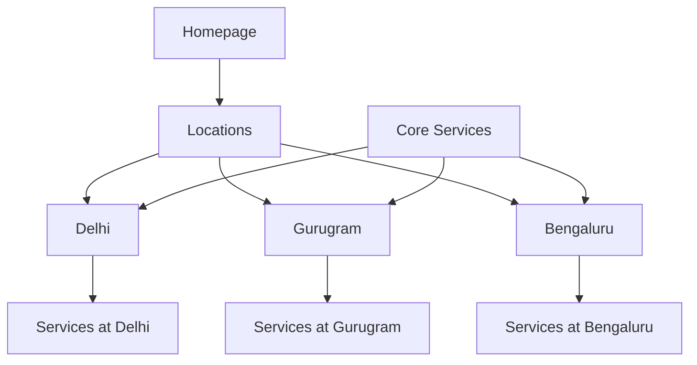

# Local SEO Audit Framework

### A Practical Framework for Auditing Google Business Profile, Local Rankings, Website Signals, Reviews, Citations and Local Search Visibility

Local SEO helps businesses become discoverable when customers search for products and services within a specific geographic market.

A strong local search strategy connects **Google Business Profile, website relevance, business information, reputation, local authority, conversion and measurement**.

This framework is designed for local businesses, professional services, clinics, multi-location companies and other organizations that depend on customers within defined service areas.

> Maintained by [Prashant Rajput](https://github.com/prashant6788)  
> Founder, [Touchstone Infotech](https://www.touchstoneinfotech.com/)

---

## 1. Objective

A Local SEO audit should answer:

- Can search engines clearly identify the business?
- Is the Google Business Profile complete and accurate?
- Are the correct primary and secondary categories selected?
- Are services, products, hours and contact details accurate?
- Does the website clearly support the locations and services the business wants to rank for?
- Is business information consistent across important sources?
- Does the business have a credible review profile?
- Are important local landing pages useful and indexable?
- Does the business have relevant local authority?
- Can users easily call, message, book, visit or enquire?
- Is local visibility measured by geography rather than only nationally?
- Can leads and revenue be connected to local search activity?

The goal is:

**Local Relevance + Proximity + Prominence + Trust + Conversion**

---

## 2. Local Search Architecture



Local SEO is an ecosystem rather than a single listing optimization task.

---

# Part I — Business & Market Setup

## 3. Define the Local Business Model

Before auditing, identify whether the business is:

- Single-location
- Multi-location
- Storefront
- Service-area business
- Hybrid business
- Professional practitioner
- Clinic
- Franchise
- Department within a larger organization

Also document:

- Business name
- Primary category
- Secondary services
- Physical locations
- Service areas
- Phone numbers
- Website
- Appointment URL
- Business hours
- Target cities
- Target neighborhoods
- Competitors

The optimization strategy should reflect the actual business model.

---

## 4. Define Local Search Markets

Do not treat an entire country or large city as one uniform local market.

Identify:

```text
Primary City
↓
Important Neighborhoods
↓
Service Areas
↓
Nearby Commercial Areas
↓
High-Value Customer Zones
```

Local visibility can vary significantly over short distances.

---

## 5. Local Keyword Research

Research combinations of:

```text
Service
Service + City
Service + Neighborhood
Service + Near Me
Service + Specialist
Problem + Location
Category + Location
```

Examples:

```text
criminal lawyer jaipur
skin clinic in dwarka
real estate agent gurgaon
SEO agency near me
physiotherapist in south delhi
```

Also review actual query data from Google Search Console and Google Business Profile performance.

---

# Part II — Google Business Profile Audit

## 6. Business Name

The profile name should represent the business's real-world name.

Audit:

- Correct spelling
- Consistency with storefront/branding
- Unnecessary keywords
- Location stuffing
- Service stuffing
- Duplicate profiles

Avoid adding keywords solely to manipulate rankings.

---

## 7. Primary Category

The primary category is one of the most important GBP configuration choices.

Review:

- Does it describe the core business?
- Does it match the primary revenue service?
- What categories do relevant competitors use?
- Is a more specific category available?
- Has the business model changed?

Do not choose categories merely because competitors use them.

The category must genuinely represent the business.

---

## 8. Secondary Categories

Secondary categories can describe additional legitimate business functions.

Audit whether they are:

- Relevant
- Accurate
- Necessary
- Supported by actual services

Avoid selecting every remotely related category.

---

## 9. Business Description

Review whether the description clearly explains:

- What the business does
- Who it serves
- Core services
- Relevant geographic context
- Differentiators

Write naturally for customers.

Do not turn the description into a block of repetitive keywords.

---

## 10. Address & Map Pin

For businesses displaying an address, verify:

- Full address
- Suite/unit
- Postal code
- Map pin
- Building location
- Entrance location where relevant
- Website consistency

Incorrect map positioning can create customer and verification problems.

---

## 11. Service Area

For service-area businesses, review:

- Actual areas served
- Unrealistically broad areas
- Old service areas
- New markets
- Address visibility rules

Adding many cities does not automatically create rankings in those locations.

---

## 12. Phone Number

Check:

- Primary phone works
- Local number where appropriate
- Call tracking implementation
- Number consistency
- Correct routing
- Business-hour handling
- Missed-call workflow

If call tracking is used, preserve consistent business information and configure it carefully.

---

## 13. Website URL

The GBP website link should lead to the most appropriate page.

Usually:

```text
Single Location → Strong Primary Business / Location Page
Multi-Location → Specific Location Page
```

Avoid sending every location to a generic homepage when useful location-specific pages exist.

---

## 14. Appointment & Action URLs

Where applicable, configure:

- Appointment booking
- Reservation
- Order
- Menu
- Service booking
- Contact

Test every action.

Broken booking links directly reduce local conversion.

---

## 15. Business Hours

Audit:

- Standard hours
- Special hours
- Holiday hours
- Seasonal changes
- Appointment-only periods

Incorrect hours create poor customer experiences and can generate negative reviews.

---

## 16. Services

Review GBP service listings for:

- Core services
- Missing services
- Old services
- Useful descriptions
- Pricing where appropriate
- Correct grouping

The service list should reflect what the business genuinely provides.

---

## 17. Products

Where GBP product features are relevant, review:

- Product/service groups
- Images
- Descriptions
- Prices
- Links
- Availability

Use them to help customers understand the offering rather than as keyword containers.

---

## 18. Photos & Videos

Review:

- Logo
- Cover image
- Exterior
- Interior
- Team
- Products
- Services
- Work examples
- Location context
- Recent media

Authentic business imagery usually builds more trust than generic stock photography.

---

## 19. GBP Posts

Where useful, posts can support customer communication.

Possible topics:

- Offers
- Events
- New services
- Educational updates
- Business announcements
- Seasonal information

Posts should serve customers first.

Do not rely on posting frequency as the core ranking strategy.

---

## 20. Questions & Answers

Review customer-facing questions visible on the profile.

Look for:

- Unanswered questions
- Incorrect answers
- Outdated information
- Common customer concerns

Important information should also exist on the website rather than relying solely on Q&A.

---

## 21. GBP Attributes

Review applicable attributes such as:

- Accessibility
- Amenities
- Service options
- Payment options
- Appointment requirements

Only select attributes that accurately describe the business.

---

# Part III — GBP Risk & Governance

## 22. Profile Ownership

Confirm:

- Primary owner
- Additional owners
- Managers
- Former employees
- Agency access
- Recovery email
- Security

Businesses should retain direct ownership of their profile.

Agency access should not become the only path to business control.

---

## 23. Duplicate Profiles

Search for:

- Old locations
- Previous business names
- Practitioner profiles
- Duplicate listings
- Automatically generated profiles

Duplicates can confuse customers and business data.

Do not merge or remove profiles without understanding whether they represent legitimate separate entities.

---

## 24. Guideline Risk

Review potential risks such as:

- Keyword-stuffed business names
- Virtual offices
- Ineligible addresses
- Duplicate profiles
- Incorrect categories
- Fake reviews
- Misleading business information

Short-term manipulation can create long-term profile risk.

---

# Part IV — Local Website Audit

## 25. Homepage Local Signals

The homepage should make the business understandable.

Review whether it clearly communicates:

- Brand
- Primary service
- Primary market
- Trust
- Contact information
- Conversion path

Avoid unnatural repetition of city names.

---

## 26. Location Pages

A useful location page may include:

```text
Location Name
Address
Phone
Hours
Map
Services
Team / Practitioner
Local Information
Directions
Reviews / Evidence
FAQs
Booking / Contact
```

Each location page should represent a real location and provide useful unique information.

---

## 27. Service + Location Pages

Create service-location pages only when there is:

- Genuine service availability
- Search demand
- Useful local information
- A distinct customer need

Avoid generating hundreds of near-identical doorway pages.

---

## 28. NAP Information

NAP commonly refers to:

**Name + Address + Phone**

Review consistency across:

- Website
- GBP
- Major directories
- Industry platforms
- Social profiles
- Map services

Minor formatting differences are usually less important than genuinely conflicting information.

---

## 29. Local Landing Page Architecture

Example:



Users and crawlers should be able to discover legitimate locations naturally.

---

## 30. On-Page Local Relevance

Review:

- Title
- H1
- Page copy
- Address
- Phone
- Services
- Local landmarks where useful
- Directions
- Internal links
- Images
- FAQs
- Testimonials

Local relevance should come from genuine business information, not repeated city keywords.

---

## 31. LocalBusiness Structured Data

Where appropriate, review structured data for:

- Business name
- Address
- Phone
- URL
- Opening hours
- Geographic coordinates
- Business type

Schema should match visible and accurate business information.

Do not use structured data to make unsupported claims.

---

## 32. Technical SEO

Check local landing pages for:

- Crawlability
- Indexability
- Canonicals
- Mobile usability
- Internal links
- Status codes
- XML sitemap inclusion
- Page speed
- JavaScript rendering

For a complete process, use the [Technical SEO Audit Framework](technical-seo-audit-framework.md).

---

# Part V — Reviews & Reputation

## 33. Review Profile

Audit:

- Total reviews
- Average rating
- Recent review activity
- Review velocity
- Review diversity
- Review quality
- Owner responses
- Negative review themes

Do not judge reputation only by the average rating.

---

## 34. Review Acquisition

Create an ethical process for requesting reviews from real customers.

Possible workflow:

```text
Service Completed
      ↓
Customer Follow-Up
      ↓
Review Request
      ↓
Direct Review Link
      ↓
Review Received
      ↓
Team Response
```

Do not:

- Buy reviews
- Create fake accounts
- Offer misleading incentives
- Pressure customers
- Selectively manipulate feedback in ways that violate platform policies

---

## 35. Review Responses

Respond professionally to both positive and negative feedback.

Useful principles:

- Be specific where appropriate
- Avoid generic automation
- Protect customer privacy
- Do not argue publicly
- Address legitimate concerns
- Move sensitive matters offline

For clinics, legal services and other sensitive industries, take particular care not to disclose confidential information.

---

## 36. Review Themes

Reviews can reveal what customers associate with the business.

Analyze themes such as:

```text
Service
Staff
Location
Speed
Quality
Expertise
Communication
Price
Outcome
```

This can inform operations, website content and positioning.

---

# Part VI — Citations & Business Listings

## 37. Citation Audit

A citation is a web reference to business information.

Review major sources relevant to:

- Country
- City
- Industry
- Profession
- Maps
- Business directories

Focus on useful, credible platforms rather than maximizing listing volume.

---

## 38. Citation Consistency

Check for:

- Old addresses
- Old phone numbers
- Old domains
- Wrong business names
- Duplicate listings
- Closed locations
- Incorrect categories

Prioritize sources that customers and search systems are likely to trust.

---

## 39. Industry-Specific Listings

Examples may include:

- Healthcare directories
- Legal directories
- Real estate platforms
- Hospitality platforms
- Professional associations
- Local chambers

Only pursue listings that are legitimate and relevant.

---

# Part VII — Local Authority & Links

## 40. Local Link Opportunities

Potential sources include:

- Local organizations
- Chambers of commerce
- Community websites
- Local media
- Suppliers
- Partners
- Associations
- Sponsorships
- Events
- Universities
- Local resource pages

The objective is to build real local authority.

---

## 41. Digital PR

Local businesses can earn visibility through:

- Expert commentary
- Local research
- Community initiatives
- Events
- Industry insights
- Local data
- Useful public resources

A relevant local mention can be more valuable than many unrelated links.

---

# Part VIII — Competitor Analysis

## 42. Local Competitor Set

Identify competitors visible for the actual target queries.

Do not rely only on businesses the owner considers competitors.

Search competitors may differ by:

- Keyword
- Neighborhood
- Device
- Searcher location

---

## 43. Competitor Audit

Compare:

- Primary category
- Secondary categories
- Review profile
- Website
- Location relevance
- Content
- Backlinks
- Citations
- Photos
- Services
- Local authority

The goal is to identify gaps, not copy competitors blindly.

---

# Part IX — Local Rank Tracking

## 44. Geographic Rank Tracking

A single ranking position can be misleading in local search.

Visibility may look like:

```text
2 km from business → Position 2
5 km away → Position 7
10 km away → Position 18
```

Use geographic/grid tracking where appropriate.

---

## 45. Track by Query Type

Monitor:

- Core category
- Service terms
- Service + city
- Service + neighborhood
- Near-me intent
- Brand terms

Separate branded and non-branded visibility.

---

# Part X — Conversion

## 46. Local Conversion Paths

Important actions may include:

- Call
- WhatsApp/message
- Directions
- Website visit
- Appointment
- Reservation
- Quote request
- Form submission
- Store visit

Make these actions easy on mobile.

---

## 47. Call Handling

Local SEO can fail operationally even when rankings are strong.

Review:

- Answer rate
- Missed calls
- Call routing
- Business hours
- Call quality
- Follow-up
- CRM logging

A missed local enquiry is a revenue leak.

---

## 48. Appointment & Lead Workflow

Example:


Local SEO should connect discovery with operations.

---

# Part XI — Measurement

## 49. GBP Performance

Review available performance data such as:

- Search visibility
- Profile interactions
- Calls
- Website clicks
- Direction requests
- Messages/bookings where available

Platform metrics and available reports can change over time, so use the current GBP interface as the source of truth.

---

## 50. Website Measurement

Track:

- Organic landing pages
- Local organic traffic
- Calls
- Forms
- Bookings
- WhatsApp clicks
- Direction clicks where practical
- Conversion rate

---

## 51. CRM Attribution

Where possible:

```text
Local Search
    ↓
Landing Page / GBP
    ↓
Lead
    ↓
CRM
    ↓
Qualified
    ↓
Appointment
    ↓
Customer
    ↓
Revenue
```

Useful CRM fields can include:

```text
Original Source
Location
Service
Landing Page
Lead Quality
Appointment Status
Opportunity Status
Revenue
```

---

## 52. Local SEO KPI Framework

### Visibility

- Local Pack visibility
- Organic local rankings
- Geographic grid coverage
- Non-brand visibility
- Branded visibility

### Reputation

- Review count
- Rating
- Recent reviews
- Response rate
- Review themes

### Engagement

- Calls
- Website visits
- Directions
- Messages
- Bookings

### Business Outcomes

- Qualified leads
- Appointments
- Store visits where measurable
- Opportunities
- Revenue

---

# Part XII — Multi-Location SEO

## 53. Multi-Location Architecture

Each legitimate location should have:

- Correct GBP
- Useful location page
- Unique address
- Correct phone
- Correct hours
- Location-specific information
- Conversion path

Example:

```text
/locations/
    ↓
/locations/delhi/
/locations/gurugram/
/locations/bengaluru/
```

---

## 54. Avoid Location Duplication

Do not create pages where only the city name changes.

Useful differentiation may include:

- Team
- Services
- Directions
- Photos
- Local reviews
- Neighborhoods served
- Local FAQs
- Local case studies
- Location-specific offers

---

## 55. Practitioner Profiles

Businesses such as clinics and law firms may have individual practitioner listings.

Review:

- Eligibility
- Business vs practitioner naming
- Categories
- Landing pages
- Phone
- Duplicate risk
- Ownership

Follow current Google Business Profile eligibility guidance for the specific business type.

---

# Part XIII — Service-Area Businesses

## 56. Service-Area SEO

For businesses visiting customers rather than serving them at a storefront:

- Configure GBP correctly
- Define legitimate service areas
- Build useful service content
- Build local authority
- Earn reviews
- Create location content only where genuine service relevance exists

Do not create fake offices simply to rank in additional cities.

---

# Part XIV — AI & Local Discovery

## 57. Local AI Visibility

Consumers may increasingly ask AI systems:

```text
best skin clinic near me
recommended criminal lawyer in Jaipur
best real estate consultant in Gurgaon
which local SEO agency works with multi-location businesses
```

Local entities should be clearly represented across credible web sources.

---

## 58. AI-Readable Local Information

Make important facts easy to find:

- Business identity
- Category
- Services
- Locations
- Hours
- Contact information
- Expertise
- Reviews
- Credentials
- FAQs
- Booking options

The objective is consistent, credible entity information.

For a broader framework, use the [AI Search Visibility Checklist](ai-search-visibility-checklist.md).

---

# Part XV — Prioritization

## 59. Local SEO Severity Model

### Critical

- GBP suspended or inaccessible
- Wrong address
- Wrong phone
- Website unavailable
- Important location page `noindex`
- Major duplicate/ownership problem

### High

- Wrong primary category
- Weak or missing location page
- Major review reputation issue
- Incorrect business hours
- Important citation conflicts
- Broken conversion path

### Medium

- Missing secondary services
- Weak internal linking
- Incomplete structured data
- Limited local content
- Old photos

### Low

- Minor formatting inconsistencies
- Low-impact directory cleanup
- Cosmetic profile improvements

---

## 60. Impact vs Effort

| Impact | Effort | Action |
|---|---|---|
| High | Low | Fix First |
| High | High | Strategic Priority |
| Medium | Low | Quick Win |
| Medium | High | Schedule |
| Low | Low | Batch |
| Low | High | Defer |

Always prioritize issues that affect customers, eligibility, visibility or conversion.

---

# Part XVI — 100-Point Local SEO Audit

## 61. Google Business Profile

- [ ] 1. Correct business name
- [ ] 2. Correct primary category
- [ ] 3. Relevant secondary categories
- [ ] 4. Accurate business description
- [ ] 5. Correct address
- [ ] 6. Correct map pin
- [ ] 7. Correct service area
- [ ] 8. Working primary phone
- [ ] 9. Correct website URL
- [ ] 10. Appointment/action URLs work
- [ ] 11. Standard hours are correct
- [ ] 12. Special hours are maintained
- [ ] 13. Services are complete
- [ ] 14. Products are reviewed where relevant
- [ ] 15. Logo is present
- [ ] 16. Cover image is appropriate
- [ ] 17. Authentic photos are present
- [ ] 18. Recent visual content exists
- [ ] 19. Applicable attributes are accurate
- [ ] 20. Customer questions are reviewed
- [ ] 21. GBP posts are used where useful
- [ ] 22. Business retains ownership
- [ ] 23. User access is reviewed
- [ ] 24. Duplicate profiles are checked
- [ ] 25. Guideline risks are reviewed

## Website & Local Landing Pages

- [ ] 26. Homepage clearly explains business
- [ ] 27. Primary location is clear
- [ ] 28. Core services are clear
- [ ] 29. Contact information is visible
- [ ] 30. Mobile CTA is easy to use
- [ ] 31. Each real location has a useful page
- [ ] 32. Location pages are unique
- [ ] 33. Location pages are crawlable
- [ ] 34. Location pages are indexable
- [ ] 35. Location pages use correct canonicals
- [ ] 36. Address matches business information
- [ ] 37. Phone information is correct
- [ ] 38. Hours are shown where appropriate
- [ ] 39. Map/directions are useful
- [ ] 40. Services are described by location
- [ ] 41. Local page titles are useful
- [ ] 42. H1 headings are descriptive
- [ ] 43. Local copy is natural
- [ ] 44. Internal links support location pages
- [ ] 45. Location pages are in XML sitemap
- [ ] 46. LocalBusiness schema is reviewed
- [ ] 47. Mobile usability is reviewed
- [ ] 48. Page speed is reviewed
- [ ] 49. Broken links are checked
- [ ] 50. Service-location doorway pages are avoided

## Reviews & Reputation

- [ ] 51. Review count is benchmarked
- [ ] 52. Average rating is reviewed
- [ ] 53. Recent review activity is reviewed
- [ ] 54. Review velocity is monitored
- [ ] 55. Review themes are analyzed
- [ ] 56. Negative reviews are reviewed
- [ ] 57. Owner response rate is reviewed
- [ ] 58. Responses protect customer privacy
- [ ] 59. Ethical review request process exists
- [ ] 60. Direct review link works
- [ ] 61. Review automation follows platform policies
- [ ] 62. Fake/incentivized review risk is absent
- [ ] 63. Other relevant review platforms are monitored
- [ ] 64. Reputation issues feed operational improvements
- [ ] 65. Review generation is ongoing

## Citations & Authority

- [ ] 66. Major citation sources are identified
- [ ] 67. Business name is accurate
- [ ] 68. Address is accurate
- [ ] 69. Phone is accurate
- [ ] 70. Website is accurate
- [ ] 71. Old listings are reviewed
- [ ] 72. Duplicate listings are reviewed
- [ ] 73. Industry directories are reviewed
- [ ] 74. Local directories are reviewed
- [ ] 75. Social profiles are consistent
- [ ] 76. Relevant local backlinks are reviewed
- [ ] 77. Community opportunities are identified
- [ ] 78. Local media opportunities are identified
- [ ] 79. Partner links are identified
- [ ] 80. Low-quality listing spam is avoided

## Local Search & Competition

- [ ] 81. Core local keywords are documented
- [ ] 82. Near-me intent is researched
- [ ] 83. Neighborhood searches are researched
- [ ] 84. Actual search competitors are identified
- [ ] 85. Competitor categories are reviewed
- [ ] 86. Competitor reviews are benchmarked
- [ ] 87. Competitor websites are reviewed
- [ ] 88. Competitor authority is reviewed
- [ ] 89. Geographic ranking variation is measured
- [ ] 90. Brand vs non-brand visibility is separated

## Conversion & Measurement

- [ ] 91. Calls are tracked where appropriate
- [ ] 92. Forms are tracked
- [ ] 93. Booking actions are tracked
- [ ] 94. WhatsApp/messages are tracked where appropriate
- [ ] 95. GBP performance is reviewed
- [ ] 96. Search Console is configured
- [ ] 97. Analytics is configured
- [ ] 98. Qualified leads are measured
- [ ] 99. CRM/source attribution exists where practical
- [ ] 100. Local SEO is evaluated against business outcomes

---

# Part XVII — Quick Local SEO Score

## 62. Five-Layer Audit Model

Score each layer from **0 to 20**.

### Layer 1 — Business Profile

GBP completeness, accuracy, eligibility and governance.

### Layer 2 — Website

Local relevance, technical health and location architecture.

### Layer 3 — Reputation

Reviews, responses, trust and customer evidence.

### Layer 4 — Authority

Citations, local links, mentions and entity consistency.

### Layer 5 — Measurement

Rank tracking, conversions, CRM attribution and business outcomes.

Total:

```text
Business Profile  /20
Website           /20
Reputation        /20
Authority         /20
Measurement       /20
----------------------
Total             /100
```

Suggested interpretation:

| Score | Status |
|---|---|
| 0–39 | Major Foundation Gaps |
| 40–59 | Basic Local Presence |
| 60–79 | Competitive Foundation |
| 80–89 | Strong Local System |
| 90–100 | Advanced Local Search Operation |

This is a practical prioritization model, not a Google ranking score.

---

# Part XVIII — Common Local SEO Mistakes

## 63. Keyword-Stuffing the GBP Name

It may create policy risk and poor brand consistency.

---

## 64. Creating Fake Locations

Virtual or fabricated locations can create verification and suspension risk.

---

## 65. Building Hundreds of Thin City Pages

Location content should provide genuine value and represent real service capability.

---

## 66. Focusing Only on Citations

Listings are one component of local authority, not the entire strategy.

---

## 67. Ignoring Reviews

Reputation affects both customer decisions and the overall strength of the local presence.

---

## 68. Tracking One Ranking

Local rankings change geographically.

Measure visibility across the actual service market.

---

## 69. Ignoring Conversion

Ranking well does not help if calls go unanswered or booking forms fail.

---

## 70. Treating GBP as Separate From the Website

The strongest local strategy connects profile information, website content, reputation, authority and operations.

---

# Part XIX — Local SEO Growth System

## 71. Seven-Layer Framework

### 1. Entity

Establish accurate business identity.

### 2. Profile

Build and maintain an accurate Google Business Profile.

### 3. Website

Create technically healthy, locally relevant pages.

### 4. Reputation

Build authentic customer evidence.

### 5. Authority

Earn relevant local citations, links and mentions.

### 6. Conversion

Make calls, bookings, visits and enquiries easy.

### 7. Measurement

Connect visibility with leads and revenue.

The complete system is:

**Entity → Profile → Website → Reputation → Authority → Conversion → Measurement**

---

## Final Principle

Local SEO is not:

> Add keywords to Google Business Profile and build directory listings.

A stronger approach is:

> **Build the clearest, most credible and most useful local presence for customers searching within the markets the business genuinely serves.**

Strong Local SEO combines:

**Google Business Profile + Website Relevance + Reviews + Local Authority + Technical SEO + Conversion + Measurement**

---

## Related Resources

### SEO Growth Framework

[SEO Growth Framework](seo-growth-framework.md)

A broader framework connecting technical SEO, search demand, content, authority, AI visibility, conversion and revenue.

### Technical SEO Audit Framework

[Technical SEO Audit Framework](technical-seo-audit-framework.md)

A 100-point technical audit framework covering crawlability, rendering, indexation, architecture and performance.

### SaaS SEO Framework

[SaaS SEO Framework](saas-seo-framework.md)

A practical framework for connecting SaaS search visibility with product discovery, pipeline and revenue.

### AI Search Visibility Checklist

[AI Search Visibility Checklist](ai-search-visibility-checklist.md)

A framework for evaluating visibility across traditional search and AI-powered discovery experiences.

---

## About the Author

**Prashant Rajput** is the Founder of [Touchstone Infotech](https://www.touchstoneinfotech.com/).

He works across **SEO/GEO, AI, automation, CRM, performance marketing and system integration**, building practical systems that connect visibility, acquisition and revenue operations.

- 13+ years in digital growth and technology
- 300+ businesses supported
- Experience across India, USA, UK, Canada & Australia
- ₹2–3 Cr+ annual media spend managed
- Leading a 26-person growth and technology team

Connect:

- [LinkedIn](https://www.linkedin.com/in/prashant6788/)
- [GitHub](https://github.com/prashant6788)
- [Touchstone Infotech](https://www.touchstoneinfotech.com/)

---

## Contributing

Suggestions, practical examples and improvements are welcome.

If you have experience with Google Business Profile, multi-location SEO, review systems, local rank tracking, citations or local search measurement, consider opening an Issue with observations or proposed improvements.

---

## Disclaimer

This framework is intended for educational and implementation-planning purposes. Google Business Profile features, eligibility rules, search interfaces and platform policies change over time. Businesses should follow current platform guidelines and adapt recommendations to their business model, market and applicable requirements.
