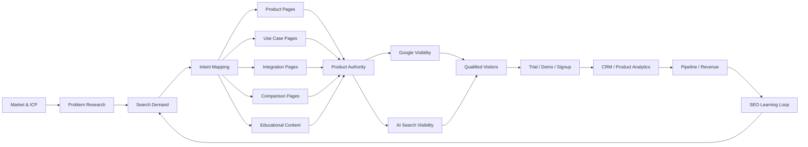
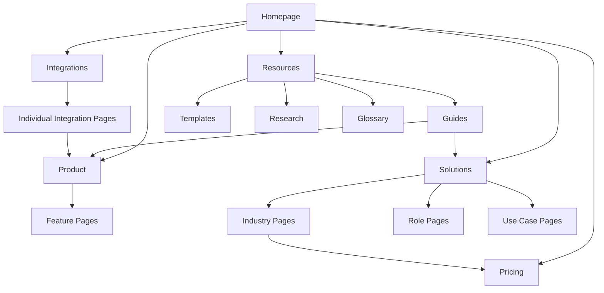
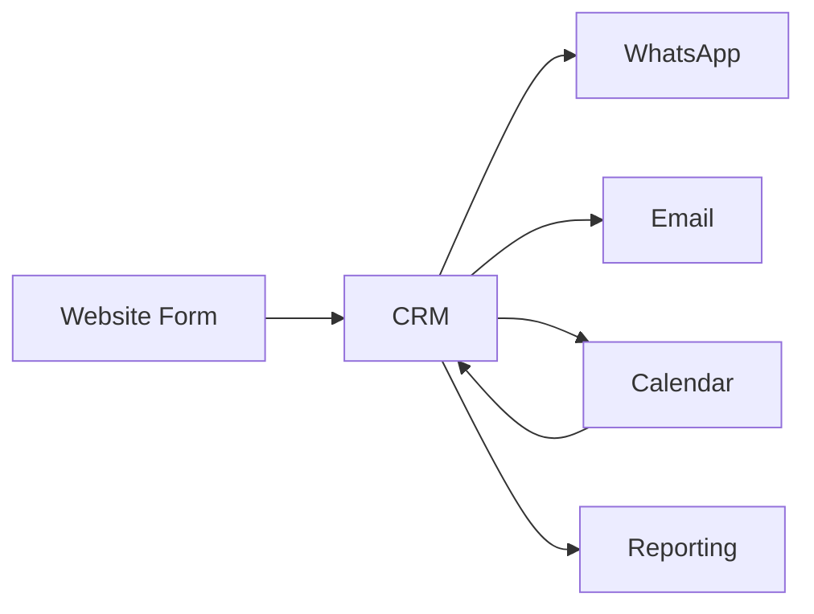
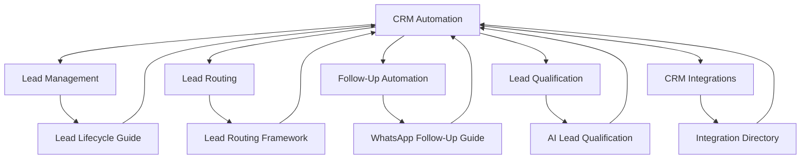
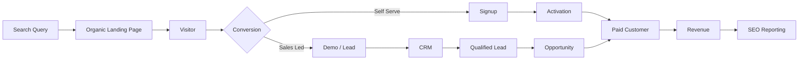

# SaaS SEO Framework

### A Practical Framework for Building Organic Visibility, Product Discovery, Authority and Pipeline for SaaS Companies

SaaS SEO should connect search demand with the complete customer journey — from discovering a problem to evaluating solutions, comparing alternatives, understanding product capabilities and eventually starting a trial, booking a demo or becoming a customer.

A strong SaaS SEO strategy is therefore not simply:

**Keywords → Blog Posts → Traffic**

A more useful model is:

**Market → Problems → Search Intent → Product → Content → Authority → AI Visibility → Conversion → Pipeline → Revenue**

> Maintained by [Prashant Rajput](https://github.com/prashant6788)  
> Founder, [Touchstone Infotech](https://www.touchstoneinfotech.com/)

---

## 1. Objective

A SaaS SEO system should help answer:

- What problems are potential customers searching for?
- Which categories and solutions are they evaluating?
- How do they describe the product before they know the brand?
- Which searches indicate commercial intent?
- Which pages should explain product capabilities?
- Which use cases deserve dedicated pages?
- Which integrations create search demand?
- Which comparison and alternative searches matter?
- What educational content builds category authority?
- Can search engines and AI systems clearly understand the product?
- Does organic visibility create qualified trials, demos and pipeline?
- Which topics actually contribute to customers and revenue?

The objective is:

**Discoverability → Product Understanding → Trust → Evaluation → Conversion → Pipeline**

---

# Part I — SaaS Search Architecture

## 2. SaaS SEO Growth Architecture



SEO should connect the search market to the actual SaaS revenue model.

---

## 3. Start With the ICP

Before keyword research, define the ideal customer profile.

Document:

- Industry
- Company size
- Geography
- Buyer role
- User role
- Technical maturity
- Existing tools
- Primary problems
- Purchase triggers
- Buying objections
- Sales cycle
- Average contract value
- Product-led vs sales-led motion

Example:

```text
Product:
CRM automation platform

ICP:
Multi-location clinics

Buyer:
Clinic owner / operations manager

Problem:
Enquiries are scattered across WhatsApp, calls and forms

Desired Outcome:
Centralized lead management and automated follow-up
```

This context helps distinguish valuable searches from irrelevant traffic.

---

# Part II — Search Demand

## 4. SaaS Search Demand Layers

SaaS demand usually appears across several layers.

### Problem Searches

The buyer understands the problem but may not know the solution category.

Examples:

```text
how to automate sales follow up
how to manage clinic enquiries
how to reduce SaaS churn
how to track leads from multiple channels
```

### Category Searches

The buyer understands the type of solution.

```text
CRM software
marketing automation software
SEO reporting software
appointment scheduling software
```

### Use Case Searches

```text
CRM for real estate
marketing automation for clinics
SEO software for agencies
lead management software for education consultants
```

### Feature Searches

```text
CRM with WhatsApp integration
AI lead qualification software
automated appointment reminders
multi-location reporting software
```

### Integration Searches

```text
HubSpot Slack integration
CRM WhatsApp integration
Shopify CRM integration
Salesforce accounting integration
```

### Comparison Searches

```text
Product A vs Product B
best alternatives to Product A
Product A alternative
best CRM for clinics
```

### Brand Searches

```text
product pricing
product reviews
product integrations
product login
product demo
```

Each layer requires different pages and conversion expectations.

---

## 5. Search Intent Matrix

| Search Type | Typical Intent | Recommended Page |
|---|---|---|
| Problem | Informational | Guide / Resource |
| Category | Commercial | Product / Category Page |
| Use Case | Commercial | Use Case Page |
| Feature | Commercial | Feature Page |
| Integration | Commercial / Technical | Integration Page |
| Comparison | High Commercial | Comparison Page |
| Alternative | High Commercial | Alternative Page |
| Brand + Pricing | Transactional | Pricing Page |
| Brand + Demo | Transactional | Demo Page |

Do not automatically create a separate page for every keyword variation.

Create pages where there is a distinct user need.

---

# Part III — SaaS Site Architecture

## 6. Recommended SaaS Architecture

A scalable SaaS website may include:

```text
/
├── product/
│   ├── feature-a/
│   ├── feature-b/
│   └── feature-c/
│
├── solutions/
│   ├── industry-a/
│   ├── industry-b/
│   └── role-a/
│
├── integrations/
│   ├── integration-a/
│   └── integration-b/
│
├── compare/
│   ├── competitor-a/
│   └── competitor-b/
│
├── alternatives/
│
├── pricing/
│
├── customers/
│
└── resources/
    ├── guides/
    ├── templates/
    ├── research/
    └── glossary/
```

The architecture should reflect the product and actual search demand rather than copying another SaaS website.

---

## 7. Commercial Page Hierarchy



Educational content should support commercial discovery rather than exist as an isolated blog.

---

# Part IV — Product & Feature SEO

## 8. Product Pages

Core product pages should clearly communicate:

- What the product is
- Who it is for
- What problem it solves
- Major capabilities
- How it works
- Integrations
- Differentiators
- Evidence
- Security or compliance where relevant
- Pricing path
- Trial/demo CTA

Search systems and users should not need to infer what the software actually does.

---

## 9. Feature Pages

Create feature pages where the feature has meaningful customer and search demand.

A useful feature page can include:

```text
Feature Definition
↓
Problem It Solves
↓
How It Works
↓
Workflow
↓
Use Cases
↓
Screenshots / Product Evidence
↓
Integrations
↓
FAQs
↓
CTA
```

Avoid creating thin feature pages containing only rewritten product marketing.

---

# Part V — Use Case & Industry SEO

## 10. Use Case Pages

Use case pages connect product capabilities with specific outcomes.

Examples:

```text
Automate Lead Follow-Up
Qualify Inbound Leads
Manage Multi-Location Enquiries
Automate Customer Onboarding
Reduce No-Shows
Track Marketing-to-Revenue
```

Strong use case pages explain the workflow, not simply insert a keyword into generic copy.

---

## 11. Industry Pages

Industry pages can be valuable when customer workflows genuinely differ.

Example:

```text
CRM for Clinics
CRM for Real Estate
CRM for Education
```

Each page should demonstrate:

- Industry-specific problem
- Workflow
- Terminology
- Product configuration
- Relevant features
- Examples
- Integrations
- Conversion path

Avoid creating hundreds of templated industry pages without meaningful differentiation.

---

# Part VI — Integration SEO

## 12. Integration Pages

Integrations can create highly qualified organic demand.

A strong integration page explains:

- What systems connect
- What data moves
- Direction of synchronization
- Trigger/action possibilities
- Authentication requirements
- Common workflows
- Limitations
- Setup process
- Product requirements

Example:



Integration pages should be useful even before the visitor becomes a customer.

---

## 13. Programmatic Integration Pages

Large SaaS companies may have hundreds of integrations.

Programmatic generation can be appropriate when each page contains genuine structured information.

Avoid generating:

```text
Connect X with Our Product
Connect Y with Our Product
Connect Z with Our Product
```

with nearly identical content.

Useful programmatic pages require unique data and practical utility.

---

# Part VII — Comparison & Alternative SEO

## 14. Comparison Pages

Comparison queries often indicate strong purchase intent.

A credible comparison should cover meaningful differences such as:

- Target customer
- Core functionality
- Pricing model
- Integrations
- Implementation
- Support
- Deployment
- Strengths
- Limitations
- Best-fit scenarios

Do not fabricate competitor weaknesses.

Transparent comparisons build more trust.

---

## 15. Alternative Pages

Alternative content should explain **why different buyers may need different products**.

Useful structure:

```text
Why Users Look for Alternatives
↓
Selection Criteria
↓
Available Options
↓
Best Fit by Use Case
↓
Your Product's Position
↓
Decision Guidance
```

Avoid publishing dozens of low-quality competitor pages solely to capture brand traffic.

---

# Part VIII — Content Strategy

## 16. SaaS Content Layers

A useful content portfolio may include:

### Category Education

Help users understand the software category.

### Problem Education

Explain business problems the product addresses.

### Implementation

Show how to solve problems practically.

### Templates

Provide immediately useful assets.

### Frameworks

Publish structured methodologies.

### Research

Create original market information.

### Product Education

Help users understand workflows and features.

### Decision Content

Support evaluation and purchase.

---

## 17. Topic Cluster Example



The cluster should create useful relationships between educational and commercial content.

---

## 18. Content Quality

Strong SaaS content often includes:

- Product screenshots
- Workflow examples
- Real implementation details
- Expert commentary
- Original diagrams
- Templates
- Data
- Benchmarks
- Customer examples
- Decision criteria
- Clear definitions
- Technical accuracy

A useful test:

> Could someone actually make a better decision or implement something after reading this page?

---

# Part IX — Original Information & Authority

## 19. Create Citation-Worthy Assets

SaaS businesses have access to information that generic publishers often do not.

Potential assets include:

- Product usage benchmarks
- Industry surveys
- Anonymous trend data
- Calculators
- Templates
- Checklists
- Frameworks
- Integration libraries
- API examples
- Original research
- State-of-the-industry reports

These assets can support:

**Links + Brand Authority + Search Visibility + AI Citations**

---

## 20. Customer Evidence

Customer evidence strengthens both conversion and authority.

Useful formats:

- Case studies
- Customer stories
- Before/after workflows
- Quantified outcomes
- Implementation examples
- Testimonials
- Industry-specific examples

Avoid unsupported performance claims.

---

# Part X — Technical SaaS SEO

## 21. Technical Audit Areas

SaaS websites should review:

- Crawlability
- Indexation
- JavaScript rendering
- Canonicals
- XML sitemaps
- Internal linking
- Redirects
- Core Web Vitals
- Structured data
- Documentation architecture
- Subdomains
- International versions
- App vs marketing site boundaries

For a complete audit methodology, see the [Technical SEO Audit Framework](technical-seo-audit-framework.md).

---

## 22. Subdomain Strategy

SaaS companies commonly use:

```text
www.example.com
app.example.com
docs.example.com
help.example.com
community.example.com
```

Decide deliberately which areas should participate in organic discovery.

Review:

- Crawl access
- Indexation
- Internal links
- Canonicals
- Authentication
- Content duplication
- Analytics
- Search Console properties

Do not assume a subdomain is automatically harmful or beneficial.

---

## 23. Documentation SEO

Technical documentation can generate high-value discovery.

Improve:

- Crawlable navigation
- Stable URLs
- Version handling
- Code examples
- Search
- Internal links
- Product references
- Breadcrumbs
- Indexation controls
- Canonicals

Documentation can also become an important source for AI systems trying to understand product functionality.

---

# Part XI — GEO & AI Search Visibility

## 24. SaaS AI Visibility

Potential buyers increasingly ask AI systems questions such as:

```text
What is the best CRM for a small clinic?
Which tools integrate WhatsApp with a CRM?
What are alternatives to Product X?
How can I automate inbound lead qualification?
```

SaaS companies should make product and category information easy to understand and verify.

---

## 25. AI Search Readiness

Review whether the web clearly explains:

- Company identity
- Product category
- Features
- Use cases
- Industries
- Pricing
- Integrations
- Differentiators
- Customer evidence
- Documentation
- Security
- Support

Content should be:

**Accessible + Structured + Specific + Credible + Reference-Worthy**

For a deeper audit, use the [AI Search Visibility Checklist](ai-search-visibility-checklist.md).

---

## 26. Entity Clarity

Search and AI systems should be able to understand:

```text
Company
   ↓
Product
   ↓
Category
   ↓
Features
   ↓
Integrations
   ↓
Use Cases
   ↓
Customers / Industries
```

Support this through consistent website language, structured information, external profiles, documentation and credible mentions.

---

# Part XII — Link & Authority Strategy

## 27. SaaS Authority Sources

Relevant authority opportunities may include:

- Industry publications
- Technology directories
- Integration partners
- Marketplace listings
- Review platforms
- Developer communities
- Podcasts
- Expert contributions
- Original research
- Digital PR
- Open-source projects
- Public frameworks and tools

Prioritize editorial relevance over raw backlink counts.

---

## 28. Integration Partnerships

Integration ecosystems can create natural authority.

Examples:

```text
Partner Directory
Integration Marketplace
Joint Guide
Technical Documentation
Implementation Tutorial
Partner Case Study
```

Partnership-driven links are most useful when they reflect a real relationship.

---

# Part XIII — Conversion

## 29. Organic Conversion Paths

Different searches require different CTAs.

### Informational Visitor

Possible CTA:

```text
Download Template
Read Related Guide
Join Newsletter
Explore Product
```

### Commercial Visitor

```text
View Product
Compare Plans
Start Trial
Book Demo
```

### High-Intent Visitor

```text
Start Free Trial
Book Demo
Contact Sales
Create Account
```

Do not force every informational visitor directly into a sales conversation.

---

## 30. Product-Led SaaS

For product-led growth, measure:

```text
Organic Visit
↓
Signup
↓
Activation
↓
Product Usage
↓
Upgrade
↓
Revenue
```

Traffic without activation may not represent useful growth.

---

## 31. Sales-Led SaaS

For sales-led businesses:

```text
Organic Visit
↓
Demo / Contact
↓
Qualified Lead
↓
Opportunity
↓
Pipeline
↓
Closed Won
```

SEO reporting should connect to CRM data wherever possible.

---

# Part XIV — Measurement

## 32. SaaS SEO KPI Framework

### Visibility

- Search impressions
- Non-brand clicks
- Commercial keyword visibility
- Category visibility
- AI mentions/citations
- Branded search demand

### Acquisition

- Organic users
- Organic signups
- Organic demos
- Organic contact requests

### Quality

- Activated signups
- Qualified leads
- Product-qualified leads
- Sales-qualified leads

### Pipeline

- Opportunities
- Pipeline value
- Win rate
- Sales cycle

### Revenue

- New ARR/MRR influenced by organic
- Customer acquisition
- Conversion to paid
- Expansion where attributable

---

## 33. SEO-to-Revenue Architecture



This is more useful than measuring rankings alone.

---

## 34. Attribution Fields

Where technically possible, preserve:

```text
Original Source
Organic Landing Page
First Conversion
Signup Date
Lead Quality
Opportunity
Product Activation
Customer Status
Revenue
```

This allows SEO teams to learn which topics create business value.

---

# Part XV — Prioritization

## 35. SaaS SEO Opportunity Score

A practical scoring model can consider:

| Factor | Weight |
|---|---:|
| ICP Relevance | 25% |
| Commercial Intent | 25% |
| Product Fit | 20% |
| Search Opportunity | 15% |
| Competitive Feasibility | 15% |

Example:

```text
Topic: CRM with WhatsApp Integration

ICP Relevance: 10/10
Commercial Intent: 9/10
Product Fit: 10/10
Search Opportunity: 7/10
Feasibility: 7/10

→ High Priority
```

Weights should be adapted to the business.

---

## 36. Impact vs Effort

| Impact | Effort | Action |
|---|---|---|
| High | Low | Do First |
| High | High | Strategic Project |
| Medium | Low | Quick Win |
| Medium | High | Schedule |
| Low | Low | Batch |
| Low | High | Defer |

Commercial pages with clear demand often deserve priority over additional top-of-funnel content.

---

# Part XVI — 90-Day SaaS SEO Plan

## 37. Days 1–30 — Foundation

Audit and map:

- ICP
- Product
- Search market
- Competitors
- Technical SEO
- Existing rankings
- Existing content
- Commercial pages
- Conversion tracking
- CRM attribution
- AI-search baseline

Outputs:

```text
Technical Backlog
Search Demand Map
Commercial Page Map
Content Inventory
Competitor Gap Analysis
Measurement Baseline
```

---

## 38. Days 31–60 — Commercial Build

Prioritize:

- Product pages
- Feature pages
- Use case pages
- Industry pages
- Integration pages
- Comparison opportunities
- Internal linking
- Structured data
- Conversion paths

Build the commercial search foundation before producing content at scale.

---

## 39. Days 61–90 — Authority & Expansion

Focus on:

- High-value educational content
- Original assets
- Customer evidence
- Digital PR
- Partner opportunities
- Content refreshes
- AI visibility testing
- Conversion analysis
- Pipeline analysis

Then create the next quarterly roadmap using outcome data.

---

# Part XVII — SaaS SEO Checklist

## 40. 75-Point SaaS SEO Checklist

### Strategy

- [ ] 1. ICP is documented
- [ ] 2. Buyer roles are documented
- [ ] 3. User roles are documented
- [ ] 4. Core customer problems are documented
- [ ] 5. Product category is clearly defined
- [ ] 6. Competitors are identified
- [ ] 7. Business goals for SEO are defined
- [ ] 8. Product-led or sales-led motion is understood
- [ ] 9. Conversion events are defined
- [ ] 10. Revenue measurement approach is defined

### Search Demand

- [ ] 11. Problem searches are researched
- [ ] 12. Category searches are researched
- [ ] 13. Feature searches are researched
- [ ] 14. Use case searches are researched
- [ ] 15. Integration searches are researched
- [ ] 16. Comparison searches are researched
- [ ] 17. Alternative searches are researched
- [ ] 18. Brand searches are reviewed
- [ ] 19. Search intent is mapped
- [ ] 20. Opportunities are prioritized by business value

### Commercial Pages

- [ ] 21. Core product page is clear
- [ ] 22. Important features have useful pages
- [ ] 23. High-value use cases are covered
- [ ] 24. Relevant industries are covered
- [ ] 25. Important integrations have useful pages
- [ ] 26. Pricing path is clear
- [ ] 27. Demo/trial paths work
- [ ] 28. Comparison opportunities are reviewed
- [ ] 29. Alternative opportunities are reviewed
- [ ] 30. Commercial pages contain product evidence

### Content

- [ ] 31. Content architecture exists
- [ ] 32. Topic clusters support commercial pages
- [ ] 33. Content matches search intent
- [ ] 34. Product expertise appears in content
- [ ] 35. Original examples are used
- [ ] 36. Screenshots are used where helpful
- [ ] 37. Templates/frameworks are considered
- [ ] 38. Original research opportunities are identified
- [ ] 39. Content refreshes are scheduled
- [ ] 40. Thin content is controlled

### Technical SEO

- [ ] 41. Important pages are crawlable
- [ ] 42. Important pages are indexable
- [ ] 43. Canonicals are correct
- [ ] 44. XML sitemap is maintained
- [ ] 45. Internal links support important pages
- [ ] 46. JavaScript rendering is tested
- [ ] 47. Core Web Vitals are monitored
- [ ] 48. Structured data is reviewed
- [ ] 49. Subdomains are intentionally managed
- [ ] 50. Documentation SEO is reviewed

### Authority

- [ ] 51. Brand/entity information is consistent
- [ ] 52. Customer evidence exists
- [ ] 53. Relevant directories are reviewed
- [ ] 54. Integration partner opportunities are used
- [ ] 55. Digital PR opportunities are identified
- [ ] 56. Original information assets exist
- [ ] 57. Relevant backlinks are monitored
- [ ] 58. Brand mentions are monitored
- [ ] 59. Expert authorship is clear
- [ ] 60. Unsupported claims are avoided

### GEO / AI Search

- [ ] 61. Product category is explicit
- [ ] 62. Features are clearly described
- [ ] 63. Integrations are documented
- [ ] 64. Use cases are clearly structured
- [ ] 65. Pricing information is accessible where appropriate
- [ ] 66. AI-search visibility is tested
- [ ] 67. Brand/entity references are consistent
- [ ] 68. Citation-worthy resources exist

### Measurement

- [ ] 69. Search Console is configured
- [ ] 70. Analytics is configured
- [ ] 71. Organic signups/demos are measured
- [ ] 72. CRM attribution is available where practical
- [ ] 73. Qualified leads are measured
- [ ] 74. Pipeline/revenue contribution is reviewed
- [ ] 75. SEO priorities are updated using outcome data

---

# Part XVIII — Common SaaS SEO Mistakes

## 41. Publishing Only Blog Content

A large blog cannot compensate for weak product, feature and solution pages.

---

## 42. Optimizing for Traffic Instead of ICP

High-volume informational traffic may produce little pipeline.

Measure lead and customer quality.

---

## 43. Thin Integration Pages

Programmatic pages without unique technical or workflow information create little value.

---

## 44. Fake Comparison Content

Biased comparisons that misrepresent competitors reduce trust.

---

## 45. Ignoring Product Data

SEO teams should learn from:

- Sales calls
- CRM
- Support questions
- Product usage
- Customer success
- Churn reasons

Search strategy becomes stronger when connected to actual customer behavior.

---

## 46. Weak Internal Linking

Educational content should connect naturally to product and solution pages.

---

## 47. Ignoring AI Discovery

Customers increasingly use AI tools for product research and comparison.

Traditional SEO remains essential, but SaaS discoverability is expanding.

---

## 48. Measuring Only Rankings

Rankings do not reveal whether visitors activate, qualify, enter pipeline or become customers.

---

# Part XIX — SaaS SEO Growth Model

## 49. Eight-Layer Framework

### Layer 1 — Market

Understand the ICP, category and customer problems.

### Layer 2 — Demand

Map problem, category, feature, integration and purchase searches.

### Layer 3 — Product

Build useful commercial pages around real capabilities.

### Layer 4 — Education

Build topical authority through genuinely useful resources.

### Layer 5 — Authority

Earn credible mentions, links, partnerships and customer evidence.

### Layer 6 — AI Visibility

Make product information structured, specific and reference-worthy.

### Layer 7 — Conversion

Connect organic discovery to signup, demo and product activation.

### Layer 8 — Revenue

Measure qualified pipeline and customer outcomes.

The model is:

**Market → Demand → Product → Education → Authority → AI Visibility → Conversion → Revenue**

---

## Final Principle

SaaS SEO should not be:

> Publish articles until organic traffic increases.

A stronger approach is:

> **Build a search ecosystem that helps the right customers discover the problem, understand the category, evaluate the product and move toward a measurable business outcome.**

Strong SaaS SEO combines:

**Technical SEO + Commercial Pages + Product Expertise + Content Authority + Integrations + GEO/AI Visibility + Conversion + Revenue Measurement**

---

## Related Resources

### SEO Growth Framework

[SEO Growth Framework](seo-growth-framework.md)

The broader framework for connecting search visibility with business growth.

### Technical SEO Audit Framework

[Technical SEO Audit Framework](technical-seo-audit-framework.md)

A 100-point technical framework for crawlability, rendering, indexation, architecture and performance.

### AI Search Visibility Checklist

[AI Search Visibility Checklist](ai-search-visibility-checklist.md)

A practical framework for evaluating visibility across Google and AI-powered discovery platforms.

---

## About the Author

**Prashant Rajput** is the Founder of [Touchstone Infotech](https://www.touchstoneinfotech.com/).

He works across **SEO/GEO, AI, automation, CRM, performance marketing and system integration**, building practical systems that connect visibility, acquisition and revenue operations.

- 13+ years in digital growth and technology
- 300+ businesses supported
- Experience across India, USA, UK, Canada & Australia
- ₹2–3 Cr+ annual media spend managed
- Leading a 26-person growth and technology team

Connect:

- [LinkedIn](https://www.linkedin.com/in/prashant6788/)
- [GitHub](https://github.com/prashant6788)
- [Touchstone Infotech](https://www.touchstoneinfotech.com/)

---

## Contributing

Suggestions, SaaS examples and implementation improvements are welcome.

If you have practical experience with SaaS SEO, product-led growth, integration SEO, documentation SEO, GEO or search-to-pipeline measurement, consider opening an Issue with observations or proposed improvements.

---

## Disclaimer

This framework is intended for educational and implementation-planning purposes. Search engines, AI discovery systems, SaaS markets and product ecosystems change over time. Recommendations should be adapted to the product, ICP, business model, technical architecture and current platform guidance.
