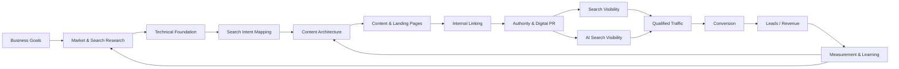
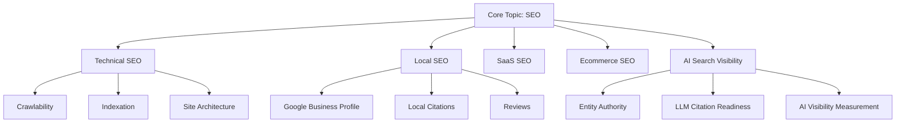

# SEO Growth Framework

### A Practical Framework for Building Search Visibility, Authority and Measurable Organic Growth

SEO works best when it is treated as a connected growth system rather than a collection of isolated tactics.

A sustainable SEO program connects business objectives, technical accessibility, search demand, content architecture, authority, AI-search visibility, conversion and measurement.

> Maintained by [Prashant Rajput](https://github.com/prashant6788)  
> Founder, [Touchstone Infotech](https://www.touchstoneinfotech.com/)

---

## 1. Objective

The objective of SEO should not be limited to rankings or traffic.

A useful SEO system should help a business:

- Become discoverable for relevant customer problems
- Build visibility across commercial and informational searches
- Create topical and entity authority
- Make important pages easy for search engines to crawl and understand
- Build content that deserves to rank and be referenced
- Improve visibility in AI-powered discovery experiences
- Convert organic visibility into meaningful business outcomes
- Measure what contributes to leads, opportunities and revenue
- Continuously improve based on search and business data

A simple model is:

**Business Goals → Search Demand → Technical Foundation → Content → Authority → Visibility → Conversion → Revenue → Learning**

---

## 2. SEO Growth Architecture



The framework is designed as a loop rather than a one-time project.

---

## 3. Start With Business Goals

Before keyword research, define what SEO is expected to contribute.

Possible business goals include:

- Generate qualified enquiries
- Increase ecommerce revenue
- Build category visibility
- Enter new markets
- Increase local discovery
- Reduce dependence on paid acquisition
- Build brand authority
- Support sales with educational content
- Improve visibility in AI-powered discovery platforms
- Increase qualified demo or consultation bookings

SEO priorities should follow business priorities.

A keyword with large search volume may be less valuable than a smaller query closely connected to revenue.

---

## 4. Define the Search Market

SEO research should identify the market the business actually competes in.

Consider:

- Target customer
- Geography
- Products and services
- Customer problems
- Competitors
- Search behavior
- Buying journey
- Industry terminology
- Alternative solutions
- Questions customers ask before purchasing

The search market is often broader than a list of direct competitors.

Businesses may compete with:

- Commercial competitors
- Publishers
- Marketplaces
- Review sites
- Forums
- Aggregators
- YouTube
- Reddit
- AI-generated answers
- Large informational websites

---

## 5. Search Demand & Keyword Research

Keyword research should organize demand rather than produce a spreadsheet of disconnected phrases.

Useful dimensions include:

- Topic
- Search intent
- Funnel stage
- Search volume
- Business relevance
- Competition
- Current ranking
- Existing page
- Required page type
- Geographic intent
- Conversion potential

### Search Intent

Common intent categories:

```text
Informational
Commercial Investigation
Transactional
Navigational
Local
```

Examples:

```text
"What is CRM automation?"
→ Informational

"Best CRM automation software for clinics"
→ Commercial Investigation

"CRM automation agency"
→ Transactional / Commercial

"Touchstone Infotech CRM automation"
→ Navigational

"SEO agency near me"
→ Local
```

Intent should influence the page that is created.

---

## 6. Opportunity Prioritization

Do not prioritize keywords using search volume alone.

A practical opportunity score can consider:

| Factor | Example Weight |
|---|---:|
| Business Relevance | 30% |
| Conversion Potential | 25% |
| Current Opportunity | 15% |
| Search Demand | 15% |
| Competitive Feasibility | 15% |

These weights are examples and should be adapted.

A useful prioritization question is:

> If we improve visibility for this topic, is it likely to create a meaningful business outcome?

---

## 7. Technical SEO Foundation

Search growth depends on a technically accessible website.

Core areas include:

### Crawlability

- Important pages accessible to crawlers
- Robots directives reviewed
- XML sitemap maintained
- Internal links expose important pages
- Crawl traps minimized
- Broken links monitored

### Indexability

- Important pages indexable
- Accidental `noindex` avoided
- Canonicals reviewed
- Duplicate pages controlled
- Thin or low-value indexation managed

### Site Architecture

- Logical hierarchy
- Important pages reachable within reasonable click depth
- Clear category and service structures
- Consistent URLs
- Useful breadcrumbs where appropriate

### Performance

- Core Web Vitals monitored
- Images optimized
- Unnecessary scripts reduced
- Mobile experience tested
- Server and caching performance reviewed

### Rendering

For JavaScript-heavy websites, verify that important content and links are available to search engines.

### Structured Data

Use relevant schema where appropriate, such as:

- Organization
- LocalBusiness
- Product
- Article
- BreadcrumbList
- FAQ where eligible and appropriate
- Event
- VideoObject

Structured data should accurately represent visible content.

---

## 8. Search Intent Mapping

Each important search theme should map to an appropriate page.

Example:

```text
Topic: CRM Automation

crm automation
        ↓
Core Service / Category Page

crm automation for clinics
        ↓
Industry Solution Page

crm lead routing
        ↓
Educational / Framework Content

crm automation pricing
        ↓
Commercial Content

how to automate lead follow-up
        ↓
Educational Article
```

Avoid forcing many different intents onto one page.

Also avoid creating dozens of nearly identical pages for minor keyword variations.

---

## 9. Content Architecture

A strong site organizes content into connected topic systems.

Example:



This creates context for users and search systems.

---

## 10. Content Quality Framework

Content should be created because it helps solve a searcher's problem, not merely because a keyword exists.

Strong content often demonstrates:

- Clear intent match
- Original understanding
- Useful depth
- Accurate information
- Practical examples
- Logical structure
- First-hand experience where available
- Expert input where relevant
- Supporting data or evidence
- Clear authorship
- Appropriate references
- Useful visuals, tables or frameworks
- Clear next step

A useful content test is:

> Would this page still be worth publishing if search engines did not exist?

If the answer is no, the content may be too search-engine-driven.

---

## 11. Answerability & AI Search

Search discovery increasingly includes AI-generated experiences.

Content should therefore be understandable at both page and passage level.

Useful characteristics include:

- Descriptive headings
- Direct answers
- Clear definitions
- Structured lists
- Tables
- Explicit relationships between concepts
- Consistent terminology
- Original examples
- Clear entity references
- Supporting evidence
- Updated information

The objective is not to write mechanically for LLMs.

It is to make useful information **clear, structured, credible and reference-worthy**.

For a deeper audit, see the [AI Search Visibility Checklist](ai-search-visibility-checklist.md).

---

## 12. Entity & Brand Authority

SEO is not only about individual URLs.

Search systems also need to understand the business or person behind the content.

Useful authority signals can include:

- Consistent brand identity
- Clear organization information
- Author pages
- Expert biographies
- Relevant credentials
- External mentions
- Reviews
- Industry profiles
- Partnerships
- Citations
- Original research
- Consistent social and business profiles

The objective is to make it easier to understand:

**Who you are → What you do → What you know → Why you are credible**

---

## 13. Internal Linking

Internal links distribute context and authority across a website.

A useful model:

```text
Core Commercial Page
      ↑       ↓
Supporting Guides
      ↑       ↓
Detailed Articles
      ↑       ↓
Case Studies / Research
```

Internal linking should help users discover related information while reinforcing topical relationships.

Review:

- Orphan pages
- Important pages with weak internal links
- Generic anchor text
- Excessive repetitive links
- Broken internal links
- New content not connected to existing clusters

---

## 14. External Authority

Links and mentions can strengthen discovery and credibility when they are earned or built responsibly.

Potential sources include:

- Industry publications
- Relevant directories
- Partner websites
- Professional associations
- Expert contributions
- Digital PR
- Original research
- Data studies
- Useful public tools
- Community contributions
- Relevant resource pages

Focus on **relevance, credibility and editorial value**, not raw backlink volume.

Avoid building a strategy around low-quality link schemes.

---

## 15. Original Information Assets

One way to improve authority is to publish information other sites and AI systems may want to reference.

Examples:

- Original research
- Benchmarks
- Industry surveys
- Calculators
- Templates
- Checklists
- Frameworks
- Public datasets
- Case studies
- Experiments
- Comparative analyses
- Implementation guides

A useful principle:

**Create something worth citing, not only something optimized for ranking.**

---

## 16. Conversion Layer

SEO growth is incomplete if qualified visitors cannot take the next step.

Review:

- Page intent
- Calls to action
- Forms
- Booking options
- Contact methods
- Trust signals
- Case studies
- Testimonials
- Product information
- Pricing clarity where appropriate
- Mobile conversion experience
- Page speed
- Sales handoff

Different content requires different conversion expectations.

An informational article may contribute through assisted conversion rather than immediate lead generation.

---

## 17. Search-to-Revenue Measurement

SEO reporting should connect visibility to business outcomes wherever possible.

A useful measurement chain is:

```text
Impressions
    ↓
Clicks
    ↓
Engaged Visits
    ↓
Conversions
    ↓
Qualified Leads
    ↓
Opportunities
    ↓
Revenue
```

Useful data sources may include:

- Google Search Console
- Web analytics
- CRM
- Call tracking
- Form tracking
- Ecommerce analytics
- Rank tracking
- AI visibility monitoring
- Sales outcome data

Do not evaluate SEO using a single metric.

---

## 18. KPI Framework

### Visibility KPIs

- Search impressions
- Ranking distribution
- Non-brand visibility
- Brand visibility
- Search features
- AI-search mentions or citations

### Engagement KPIs

- Organic sessions
- Landing-page engagement
- Key page visits
- Returning users

### Conversion KPIs

- Form submissions
- Calls
- Demo requests
- Appointment bookings
- Purchases

### Revenue KPIs

- Qualified leads
- Opportunities
- Pipeline value
- Revenue
- Customer acquisition contribution

### Authority KPIs

- Referring domains
- Relevant brand mentions
- Links to important assets
- Citation growth
- Branded search demand

---

## 19. SEO Reporting Framework

A useful monthly report should answer:

### What changed?

Visibility, traffic, rankings, conversions and technical health.

### Why did it change?

Content, technical improvements, algorithm changes, competition, seasonality or demand.

### What business impact occurred?

Leads, opportunities, sales or other meaningful outcomes.

### What should happen next?

Prioritized actions for the next period.

Reporting should support decisions rather than simply display charts.

---

## 20. 90-Day SEO Growth Model

SEO is ongoing, but a 90-day implementation cycle can create focus.

### Days 1–30: Foundation

Focus on:

- Business goals
- Analytics validation
- Search Console review
- Technical audit
- Indexation
- Keyword and market research
- Competitor analysis
- Existing content inventory
- Search intent mapping
- Conversion tracking
- Initial AI-search baseline

Outputs:

```text
Technical Priorities
Keyword / Topic Map
Content Inventory
Opportunity Backlog
Measurement Baseline
```

### Days 31–60: Build

Focus on:

- High-priority technical fixes
- Commercial page improvements
- Content architecture
- Internal linking
- New high-value content
- Entity signals
- Structured data
- Conversion improvements
- Authority outreach preparation

### Days 61–90: Expand & Measure

Focus on:

- Additional topic coverage
- Authority building
- Digital PR / outreach
- AI-search testing
- Content refreshes
- Conversion analysis
- Ranking and visibility review
- Lead quality review
- Next-quarter prioritization

The goal after 90 days is not to declare SEO complete.

It is to have a functioning growth system with a clear next iteration.

---

## 21. SEO Prioritization Matrix

Not every issue deserves immediate attention.

A practical matrix:

| Impact | Effort | Priority |
|---|---|---|
| High | Low | Do First |
| High | High | Plan Strategically |
| Low | Low | Quick Win / Batch |
| Low | High | Usually Defer |

Also consider:

- Revenue relevance
- Number of affected pages
- Technical dependency
- Implementation risk
- Search demand
- Current visibility
- Strategic importance

---

## 22. Content Refresh System

Existing content can often produce growth faster than publishing continuously.

Review pages for:

- Declining impressions
- Declining rankings
- Outdated information
- Weak intent match
- Missing subtopics
- Poor internal links
- Weak conversion path
- New competitor coverage
- Changes in SERP format
- AI-search opportunities

Possible actions:

```text
Keep
Update
Expand
Merge
Redirect
Reposition
Remove from Index
```

Do not update content simply to change the publication date.

---

## 23. Competitive Gap Analysis

Competitor research should identify opportunities rather than encourage copying.

Review:

- Topics competitors cover
- Topics they ignore
- Commercial page structure
- Content depth
- Internal linking
- Backlink sources
- Original assets
- Search features
- Brand authority
- Local visibility
- AI-search visibility

The strongest opportunity may be something competitors have **not** built.

---

## 24. SEO + Paid Media

SEO and paid acquisition can inform each other.

Paid search can reveal:

- High-converting queries
- Strong commercial messages
- Geographic performance
- Landing-page conversion patterns

SEO can support paid media through:

- Better landing pages
- Stronger content
- Brand trust
- Lower dependence on paid traffic
- Remarketing audiences

The channels should share learning where possible.

---

## 25. SEO + CRM

Connecting SEO with CRM data can improve decision-making.

Example:

```text
Organic Landing Page
       ↓
Lead
       ↓
CRM
       ↓
Qualified?
       ↓
Opportunity?
       ↓
Won?
       ↓
Revenue
```

This helps distinguish:

**Traffic-generating SEO** from **revenue-contributing SEO**.

Useful CRM fields may include:

- Original source
- Landing page
- Campaign
- Service interest
- Lead quality
- Opportunity stage
- Revenue

---

## 26. SEO + AI Workflow

AI can assist SEO operations with:

- Keyword classification
- Search intent grouping
- Content gap analysis
- Content briefs
- Entity extraction
- Internal linking suggestions
- Structured data drafting
- Content quality checks
- Reporting summaries
- Search Console analysis
- Content refresh identification

Human review remains important for:

- Strategy
- Accuracy
- Original insight
- Brand positioning
- Expert claims
- Prioritization
- Final publication

Use AI to improve the workflow, not to flood the web with undifferentiated content.

---

## 27. Industry Adaptation

The core framework should be adapted by business model.

### SaaS

Focus may include:

- Product pages
- Feature pages
- Integration pages
- Use cases
- Comparison content
- Alternatives
- Technical education
- Demo conversion

### Real Estate

Focus may include:

- Project pages
- Location pages
- Property categories
- Local intent
- Developer authority
- Market guides
- Lead quality

### Education

Focus may include:

- Program pages
- Course pages
- Admissions intent
- Eligibility
- Location
- Career outcomes
- Counselling conversion

### Ecommerce

Focus may include:

- Category pages
- Product pages
- Faceted navigation
- Product schema
- Buying guides
- Internal linking
- Merchant information
- Conversion

### Local Businesses

Focus may include:

- Google Business Profile
- Local landing pages
- Reviews
- Local citations
- Services
- proximity and relevance signals
- Local conversion actions

---

## 28. Common SEO Growth Mistakes

### Chasing traffic without business relevance

More traffic does not automatically mean more growth.

### Publishing without architecture

Hundreds of disconnected articles rarely create a coherent search system.

### Ignoring technical problems

Great content cannot perform well if important pages are difficult to crawl or index.

### Targeting keywords instead of intent

Minor keyword variations do not always require separate pages.

### Treating backlinks as a volume game

Low-quality links can create risk without meaningful authority.

### Ignoring conversion

Rankings are less valuable if the website cannot convert relevant visitors.

### Reporting only rankings

Management needs business context.

### Automating content without quality control

AI can increase production speed while also increasing low-value output.

### Ignoring AI-powered discovery

Traditional search remains important, but discovery behavior is expanding.

### Expecting SEO to be finished

Markets, competitors, websites and search systems continuously change.

---

## 29. SEO Growth Readiness Checklist

Before scaling SEO:

- [ ] Business goals are documented
- [ ] Conversion tracking works
- [ ] Search Console is configured
- [ ] Important pages are crawlable
- [ ] Important pages are indexable
- [ ] Site architecture is understandable
- [ ] Search demand has been researched
- [ ] Search intent is mapped
- [ ] Commercial pages are identified
- [ ] Content inventory exists
- [ ] Internal linking is reviewed
- [ ] Structured data is reviewed
- [ ] Brand/entity information is consistent
- [ ] Authority strategy exists
- [ ] AI-search visibility has a baseline
- [ ] CRM attribution is available where practical
- [ ] Qualified leads can be distinguished
- [ ] Reporting connects activity to outcomes
- [ ] Priorities are ranked by impact
- [ ] A repeatable review cycle exists

---

## 30. The SEO Growth System

The framework can be summarized in ten layers.

### 1. Goals
Define the business outcome.

### 2. Research
Understand customers, competitors and search demand.

### 3. Foundation
Make the website technically accessible and understandable.

### 4. Intent
Map customer searches to appropriate pages.

### 5. Content
Create useful, differentiated information and commercial experiences.

### 6. Authority
Build credible brand, entity and external signals.

### 7. AI Visibility
Make useful information clear, structured and reference-worthy.

### 8. Conversion
Turn relevant discovery into meaningful customer actions.

### 9. Measurement
Connect search performance with business outcomes.

### 10. Iteration
Use the data to decide what to improve next.

The complete system is:

**Goals → Research → Foundation → Intent → Content → Authority → AI Visibility → Conversion → Measurement → Iteration**

---

## Final Principle

SEO growth is not:

> Publish more content and build more backlinks.

A stronger model is:

> **Build the most useful, technically accessible, authoritative and measurable search presence for the customers and topics that matter to the business.**

Sustainable SEO combines:

**Technical SEO + Search Intent + Content Architecture + Authority + AI Search Visibility + Conversion + Measurement**

---

## Related Resources

### AI Search Visibility Checklist

[AI Search Visibility Checklist](ai-search-visibility-checklist.md)

A practical framework for evaluating visibility across Google AI experiences, ChatGPT, Gemini, Perplexity and other AI-powered discovery platforms.

Additional technical, local SEO and GEO frameworks will be added to this repository as they are completed.

---

## About the Author

**Prashant Rajput** is the Founder of [Touchstone Infotech](https://www.touchstoneinfotech.com/).

He works across **SEO/GEO, AI, automation, CRM, performance marketing and system integration**, building practical systems that connect visibility, acquisition and revenue operations.

- 13+ years in digital growth and technology
- 300+ businesses supported
- Experience across India, USA, UK, Canada & Australia
- ₹2–3 Cr+ annual media spend managed
- Leading a 26-person growth and technology team

Connect:

- [LinkedIn](https://www.linkedin.com/in/prashant6788/)
- [GitHub](https://github.com/prashant6788)
- [Touchstone Infotech](https://www.touchstoneinfotech.com/)

---

## Contributing

Suggestions, practical examples and improvements are welcome.

If you have experience with SEO, GEO, technical search optimization or search-to-revenue measurement, consider opening an Issue with observations or proposed improvements.

---

## Disclaimer

This framework is intended for educational and implementation-planning purposes. Search systems, ranking factors, AI discovery experiences and platform features change over time. Recommendations should be adapted to the website, market, business model and current search-engine guidance.
