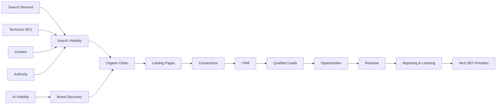
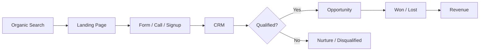

# SEO Reporting Framework

### A Practical Framework for Connecting Search Visibility, Technical Progress, Content Performance, Leads, Pipeline and Revenue

SEO reporting should help people make decisions.

A useful SEO report does more than show rankings, traffic and completed tasks. It explains **what changed, why it changed, what business impact occurred, what was learned and what should happen next**.

This framework is designed for in-house teams, agencies, consultants and businesses that want SEO reporting to connect search performance with measurable business outcomes.

> Maintained by [Prashant Rajput](https://github.com/prashant6788)  
> Founder, [Touchstone Infotech](https://www.touchstoneinfotech.com/)

---

## 1. Objective

An SEO reporting system should answer:

- Are we becoming more visible for the topics that matter?
- Is non-brand search visibility improving?
- Which pages and topics are gaining or losing visibility?
- Are important commercial pages improving?
- Is technical SEO health improving?
- Is published content producing meaningful outcomes?
- Are we building authority?
- Are we becoming more visible in AI-powered discovery?
- Is organic traffic converting?
- Are organic leads qualified?
- Is SEO contributing to opportunities, pipeline or revenue?
- What caused meaningful changes?
- What should be prioritized next?

The reporting chain is:

**Visibility → Traffic → Engagement → Conversion → Lead Quality → Pipeline → Revenue → Learning**

---

# Part I — Reporting Architecture

## 2. SEO Measurement Architecture



Not every business can measure every layer perfectly, but reporting should move as far toward business outcomes as the available data allows.

---

## 3. Reporting Principles

A useful report should be:

### Relevant

Focus on metrics connected to the business and SEO strategy.

### Comparable

Use consistent periods and definitions.

### Explainable

Provide context for meaningful changes.

### Actionable

Translate findings into priorities.

### Segmented

Separate data where aggregation hides useful insights.

### Honest

Distinguish correlation, attribution and assumptions.

### Repeatable

Use a reporting structure that can be maintained over time.

---

# Part II — Start With Business Goals

## 4. Define SEO Outcomes

Before choosing metrics, define what SEO is expected to achieve.

Examples:

```text
SaaS
→ Qualified demos, signups, pipeline, ARR/MRR

Ecommerce
→ Transactions, revenue, new customers

Local Business
→ Calls, directions, bookings, appointments

Professional Services
→ Qualified enquiries, consultations, opportunities

Publisher
→ Audience growth, subscriptions, ad revenue
```

Traffic is useful only in the context of the business model.

---

## 5. KPI Hierarchy

Use a hierarchy rather than treating every metric equally.

### Level 1 — Business Outcomes

- Revenue
- Pipeline
- Opportunities
- Customers
- Qualified leads
- Transactions

### Level 2 — Conversions

- Demo requests
- Forms
- Calls
- Signups
- Bookings
- Purchases

### Level 3 — Acquisition

- Organic clicks
- Organic sessions
- New users
- Landing-page visits

### Level 4 — Visibility

- Impressions
- Rankings
- Search features
- AI mentions/citations
- Share of visibility

### Level 5 — Inputs

- Technical fixes
- Content published
- Content updated
- Links/mentions earned
- Pages optimized

Inputs explain the work. Outcomes explain whether it mattered.

---

# Part III — Data Sources

## 6. Search Console

Google Search Console can support reporting on:

- Clicks
- Impressions
- CTR
- Average position
- Queries
- Pages
- Countries
- Devices
- Search appearance
- Indexing
- Core Web Vitals
- Sitemaps

Use Search Console primarily for Google organic search performance rather than treating it as a complete analytics system.

---

## 7. Web Analytics

Analytics can help measure:

- Organic sessions
- Landing pages
- Engagement
- Conversions
- Ecommerce
- User journeys
- Assisted behavior

Validate channel definitions and conversion events before relying on the numbers.

---

## 8. CRM

CRM data can answer questions search analytics cannot.

Examples:

- Was the lead qualified?
- Which service was requested?
- Did the lead become an opportunity?
- What was the pipeline value?
- Was the opportunity won?
- What revenue was generated?

A strong SEO reporting system should connect to CRM outcomes where practical.

---

## 9. Rank Tracking

Rank tracking is useful for:

- Priority commercial queries
- Topic groups
- Locations
- Competitor comparison
- SERP features

Avoid reporting hundreds of keyword positions without interpretation.

---

## 10. Crawlers & Technical Monitoring

Technical tools can support:

- Indexability
- Status codes
- Canonicals
- Internal linking
- Crawl depth
- Structured data
- Metadata
- Site architecture

Technical metrics should be tied to affected page types and impact.

---

## 11. Backlink & Authority Data

Authority reporting may include:

- New referring domains
- Lost referring domains
- Relevant links
- Links to strategic pages
- Brand mentions
- Digital PR coverage

Avoid making total backlink count the primary authority KPI.

---

## 12. AI Visibility Data

Where relevant, track:

- Brand mentions
- Product/service mentions
- Citation/link rate
- Citation sources
- Prompt coverage
- Accuracy
- Competitor visibility
- AI referral traffic where identifiable

For methodology, see the [GEO / LLM Visibility Framework](geo-llm-visibility-framework.md).

---

# Part IV — Reporting Segmentation

## 13. Brand vs Non-Brand

Separate branded and non-branded search where useful.

```text
Brand:
touchstone infotech
company x pricing

Non-Brand:
SEO agency
CRM automation software
technical SEO audit
```

Branded growth may reflect broader marketing activity, while non-brand growth often provides a clearer view of category discovery.

---

## 14. Commercial vs Informational

Separate pages and queries by intent.

### Commercial

```text
Service Pages
Product Pages
Category Pages
Use Case Pages
Location Pages
Comparison Pages
```

### Informational

```text
Articles
Guides
Glossary
Research
Templates
Frameworks
```

A decline in blog traffic and growth in commercial-page conversions can still represent a positive business outcome.

---

## 15. New vs Existing Content

Track:

```text
New Pages
Updated Pages
Unchanged Pages
```

This helps determine whether growth is coming from publishing, refreshing or existing authority.

---

## 16. Topic / Service Segmentation

Group performance by meaningful business areas.

Example:

```text
SEO
├── Technical SEO
├── Local SEO
├── SaaS SEO
└── GEO / AI Search

Automation
├── CRM
├── Lead Routing
├── WhatsApp
└── AI Qualification
```

Topic-level reporting is often more useful than URL-by-URL reporting.

---

## 17. Geography

For international or local businesses, segment by:

- Country
- State
- City
- Location
- Service area

Local SEO may also require geographic grid rank tracking.

---

## 18. Device

Review mobile and desktop when performance differences are meaningful.

Investigate:

- CTR differences
- Conversion differences
- UX problems
- Page performance

---

# Part V — Visibility Reporting

## 19. Search Visibility

Useful visibility metrics include:

- Total impressions
- Non-brand impressions
- Priority topic impressions
- Commercial page impressions
- Ranking distribution
- Top 3 / Top 10 / Top 20 keyword counts
- Search feature visibility

Do not treat average position as a precise universal ranking.

It is an aggregated metric and requires context.

---

## 20. Ranking Distribution

A useful model:

| Ranking Group | Current | Previous | Change |
|---|---:|---:|---:|
| Positions 1–3 | — | — | — |
| Positions 4–10 | — | — | — |
| Positions 11–20 | — | — | — |
| Positions 21–50 | — | — | — |

This can reveal movement that a simple average ranking hides.

---

## 21. Query Movement

Report meaningful query groups:

### Winners

Queries gaining useful visibility.

### Decliners

Queries losing visibility.

### Near-Wins

Commercially relevant queries in positions where improvement could create meaningful traffic.

### New Opportunities

Queries receiving impressions without dedicated or well-optimized content.

---

# Part VI — Traffic Reporting

## 22. Organic Traffic

Report:

- Organic users/sessions
- Organic landing-page sessions
- New vs returning users where useful
- Engaged sessions
- Geographic traffic
- Device performance

Avoid celebrating traffic growth without evaluating quality.

---

## 23. Landing Page Performance

A useful table:

| Landing Page | Clicks | Sessions | Conversions | Qualified Leads | Trend |
|---|---:|---:|---:|---:|---|
| Page A | — | — | — | — | ↑ |
| Page B | — | — | — | — | ↓ |

This connects search discovery to page outcomes.

---

## 24. Traffic Quality

Possible quality indicators:

- Engagement
- Conversion rate
- Product usage after signup
- Lead qualification
- Sales acceptance
- Revenue

The right quality metric depends on the business model.

---

# Part VII — Conversion Reporting

## 25. Conversion Events

Define primary and secondary conversions.

### Primary

```text
Purchase
Qualified Demo
Appointment
Sales Enquiry
Signup
```

### Secondary

```text
Newsletter Signup
Template Download
WhatsApp Click
Phone Click
Pricing Page Visit
```

Do not report all events as equally valuable.

---

## 26. Conversion Rate

Basic formula:

```text
Organic Conversion Rate
=
Organic Conversions / Organic Visits × 100
```

Segment by:

- Landing page
- Page type
- Device
- Geography
- Brand/non-brand
- Topic

---

# Part VIII — Lead Quality & CRM Reporting

## 27. Search-to-CRM Architecture



This creates a more useful SEO measurement system than form submissions alone.

---

## 28. Recommended CRM Fields

Where practical:

```text
Original Source
Original Landing Page
First Conversion
Service / Product Interest
Location
Lead Quality
Opportunity Stage
Opportunity Value
Won / Lost
Revenue
```

Preserve first-touch information rather than overwriting it with every later interaction.

---

## 29. Lead Quality Metrics

Track:

- Total organic leads
- Qualified organic leads
- Qualification rate
- Sales-accepted leads
- Opportunities
- Opportunity rate
- Won customers

Example:

```text
100 Organic Leads
↓
55 Qualified
↓
30 Opportunities
↓
10 Customers
```

This is more informative than reporting "100 leads."

---

# Part IX — Pipeline & Revenue

## 30. Pipeline Contribution

Possible metrics:

```text
Organic Opportunities
Organic Pipeline Value
Average Opportunity Value
Win Rate
Sales Cycle
```

For long sales cycles, pipeline may be more useful than same-month revenue.

---

## 31. Revenue Contribution

Where attribution supports it, report:

- Organic-attributed revenue
- Organic-influenced revenue
- Ecommerce revenue
- New MRR / ARR
- Customer count

Clearly define the attribution model used.

Do not present influenced revenue as fully attributed revenue.

---

## 32. SEO ROI

A simple model:

```text
SEO ROI
=
(SEO-Attributed Gross Return - SEO Investment)
/
SEO Investment
× 100
```

However, ROI interpretation should consider:

- Attribution model
- Sales cycle
- Gross margin
- Retention
- Customer lifetime value
- Brand effects
- Assisted conversions

SEO value is not always captured in a single-month calculation.

---

# Part X — Technical SEO Reporting

## 33. Technical Health

Report technical changes that materially affect search.

Examples:

- Indexable page count
- Important indexing problems
- 4xx/5xx errors
- Redirect chains
- Canonical conflicts
- Orphan pages
- Core Web Vitals
- Structured data issues

Avoid sending stakeholders every crawler warning.

Prioritize business impact.

---

## 34. Technical Issue Reporting Template

```text
Issue
↓
Affected URLs / Templates
↓
Business / Search Impact
↓
Status
↓
Owner
↓
Expected Resolution
↓
Validation
```

Example:

```text
Issue:
Important service pages were orphaned.

Affected:
28 URLs

Impact:
Reduced discovery and internal authority.

Status:
Fixed

Validation:
Re-crawl confirms all pages now receive contextual internal links.
```

---

# Part XI — Content Reporting

## 35. Content Performance

Evaluate content by:

- Search visibility
- Organic clicks
- Engagement
- Assisted conversion
- Direct conversion
- Links
- AI citations
- Topic contribution

Not every article needs to generate a direct lead.

---

## 36. Content Lifecycle

Classify content as:

```text
Grow
Maintain
Refresh
Merge
Reposition
Redirect
Remove
```

Use data to determine the next action.

---

## 37. Content Decay

Identify pages with:

- Falling impressions
- Falling clicks
- Ranking losses
- Outdated information
- Competitor displacement
- Search intent changes

Report the opportunity, not just the decline.

---

# Part XII — Authority Reporting

## 38. Link Quality

Report links based on factors such as:

- Relevance
- Editorial context
- Source credibility
- Target page
- Referral value

Avoid presenting domain metrics from third-party tools as if they were Google metrics.

---

## 39. Brand Mentions

Track meaningful:

- Media mentions
- Partner mentions
- Expert citations
- Industry references
- Unlinked mentions

Authority reporting should show whether the brand's information ecosystem is becoming stronger.

---

# Part XIII — GEO / AI Visibility Reporting

## 40. AI Visibility Dashboard

A simple dashboard can include:

| Metric | Current | Previous | Trend |
|---|---:|---:|---|
| Priority Prompts Tested | — | — | — |
| Brand Mention Rate | — | — | — |
| Citation Rate | — | — | — |
| Accurate Mention Rate | — | — | — |
| Competitor Mention Share | — | — | — |

These are internal measurement metrics rather than standardized AI platform ranking scores.

---

## 41. AI Citation Sources

Record which sources AI systems reference.

Group them into:

```text
Owned Website
Third-Party Media
Directories
Review Platforms
Communities
Documentation
Competitor Sites
Research Sources
```

This can inform content and authority strategy.

---

# Part XIV — Period Comparisons

## 42. Month-over-Month

Useful for operational monitoring.

Be careful with:

- Different month lengths
- Seasonality
- Holidays
- campaigns
- demand changes

---

## 43. Year-over-Year

Useful for businesses with seasonal demand.

Compare equivalent periods where possible.

---

## 44. Rolling Periods

Examples:

```text
Last 28 Days vs Previous 28 Days
Last 90 Days vs Previous 90 Days
```

Rolling comparisons can reduce calendar-month noise.

---

## 45. Annotation

Maintain a timeline of important events:

```text
Website Migration
Google Update
Major Content Launch
Technical Deployment
Tracking Change
PR Campaign
Product Launch
Seasonal Event
```

Annotations make reporting easier to interpret later.

---

# Part XV — Executive Reporting

## 46. One-Page Executive Summary

A useful executive report should answer five questions:

### 1. What happened?

Key changes.

### 2. Why?

Likely causes supported by evidence.

### 3. What business impact occurred?

Conversions, qualified leads, pipeline or revenue.

### 4. What did we do?

Major strategic work.

### 5. What happens next?

Prioritized actions.

---

## 47. Example Executive Summary Structure

```markdown
## Executive Summary

### Performance
Organic non-brand clicks increased 18% compared with the previous period.

### Business Impact
Organic search generated 42 enquiries, of which 24 were qualified and 8 became opportunities.

### Key Driver
Three improved commercial landing pages generated most of the increase.

### Risk
A high-value category lost visibility after competitor pages expanded significantly.

### Next Priority
Refresh the category page, strengthen supporting content and improve internal links.
```

Use actual verified numbers in real reports.

---

# Part XVI — Monthly SEO Report Template

## 48. Recommended Structure

```text
1. Executive Summary
2. Business Outcomes
3. Search Visibility
4. Organic Traffic
5. Conversions
6. Lead Quality / CRM
7. Pipeline / Revenue
8. Commercial Page Performance
9. Content Performance
10. Technical SEO
11. Authority / Links
12. GEO / AI Visibility
13. Key Wins
14. Risks / Issues
15. Next-Month Priorities
```

This keeps the report connected to decisions.

---

# Part XVII — Dashboard Design

## 49. Dashboard Layers

### Executive Layer

```text
Revenue
Pipeline
Qualified Leads
Conversions
Organic Growth
```

### SEO Management Layer

```text
Clicks
Impressions
Commercial Visibility
Content Performance
Technical Health
Authority
AI Visibility
```

### Analyst Layer

```text
Queries
URLs
Indexation
Crawl Data
Keyword Groups
Page-Level Conversion
Technical Issues
```

Do not force executives to interpret analyst-level dashboards.

---

## 50. Avoid Dashboard Overload

A dashboard should not contain every available metric.

Ask:

> If this metric changes, will someone make a different decision?

If not, it may not belong in the main dashboard.

---

# Part XVIII — Reporting by Business Model

## 51. SaaS

Prioritize:

```text
Non-Brand Visibility
Organic Signups
Activated Signups
Qualified Demos
Opportunities
Pipeline
MRR / ARR
AI Product Visibility
```

---

## 52. Ecommerce

Prioritize:

```text
Category/Product Visibility
Organic Sessions
Transactions
Revenue
Conversion Rate
Average Order Value
New Customers
Product Visibility
```

---

## 53. Local Business

Prioritize:

```text
Local Visibility
GBP Interactions
Calls
Directions
Bookings
Qualified Leads
Appointments
Revenue
```

---

## 54. Professional Services

Prioritize:

```text
Commercial Search Visibility
Qualified Enquiries
Consultations
Opportunities
Pipeline
Revenue
```

---

# Part XIX — Reporting Governance

## 55. Metric Definitions

Document every important KPI.

Example:

```text
Qualified Organic Lead

Definition:
A lead whose original source is organic search and that meets the company's documented qualification criteria.
```

This prevents teams from using the same term differently.

---

## 56. Data Ownership

Assign responsibility for:

- Search Console
- Analytics
- CRM
- Rank tracking
- Technical monitoring
- AI visibility
- Revenue data

Reporting fails when nobody owns data quality.

---

## 57. Tracking Changes

Document changes to:

- Analytics configuration
- Conversion events
- CRM fields
- Consent management
- Domain
- Website architecture
- Attribution

A tracking change can look like a performance change if it is not documented.

---

# Part XX — 30-Minute Monthly Reporting Workflow

## 58. Step 1 — Validate Data

Check:

- Tracking works
- Period is correct
- Major anomalies
- Tracking changes
- CRM sync

---

## 59. Step 2 — Find Meaningful Changes

Review:

```text
Visibility
Traffic
Conversions
Qualified Leads
Pipeline
Technical Health
```

Focus on material movement.

---

## 60. Step 3 — Diagnose

Ask:

- Which queries changed?
- Which pages changed?
- Was the change branded or non-branded?
- Was it seasonal?
- Did search demand change?
- Was there a technical issue?
- Did competitors change?
- Was content updated?
- Did conversion rate change?

---

## 61. Step 4 — Connect to Business Outcomes

Move from:

```text
Clicks
```

toward:

```text
Qualified Leads → Opportunities → Revenue
```

as far as the available data allows.

---

## 62. Step 5 — Decide Next Actions

Limit the report to a small number of meaningful priorities.

Example:

```text
Priority 1:
Improve high-impression commercial pages ranking 5–15.

Priority 2:
Resolve indexation problem affecting product templates.

Priority 3:
Refresh declining high-conversion content.
```

---

# Part XXI — 100-Point SEO Reporting Audit

## 63. Strategy & Goals

- [ ] 1. SEO business goals are documented
- [ ] 2. Primary conversions are defined
- [ ] 3. Secondary conversions are defined
- [ ] 4. Business KPIs are defined
- [ ] 5. SEO KPIs align with business goals
- [ ] 6. Reporting audience is defined
- [ ] 7. Reporting frequency is defined
- [ ] 8. Attribution limitations are documented
- [ ] 9. Baseline period exists
- [ ] 10. Targets are realistic and documented

## Data Quality

- [ ] 11. Search Console is configured
- [ ] 12. Analytics is configured
- [ ] 13. Conversion tracking is validated
- [ ] 14. CRM data is available where practical
- [ ] 15. Source attribution is preserved
- [ ] 16. Landing-page attribution is preserved
- [ ] 17. Tracking changes are documented
- [ ] 18. Spam/internal traffic is reviewed where relevant
- [ ] 19. Data anomalies are investigated
- [ ] 20. Metric definitions are documented

## Visibility

- [ ] 21. Search impressions are reported
- [ ] 22. Organic clicks are reported
- [ ] 23. Brand/non-brand is segmented
- [ ] 24. Commercial visibility is reported
- [ ] 25. Priority topics are reported
- [ ] 26. Ranking distribution is reviewed
- [ ] 27. Query winners are identified
- [ ] 28. Query declines are identified
- [ ] 29. Near-win opportunities are identified
- [ ] 30. Search feature visibility is reviewed where relevant

## Traffic & Landing Pages

- [ ] 31. Organic traffic is reported
- [ ] 32. Landing pages are analyzed
- [ ] 33. Commercial pages are separated
- [ ] 34. Informational pages are separated
- [ ] 35. New vs existing content is reviewed
- [ ] 36. Geography is reviewed where relevant
- [ ] 37. Device performance is reviewed where relevant
- [ ] 38. Engagement is reviewed appropriately
- [ ] 39. Traffic quality is considered
- [ ] 40. Traffic is not reported without business context

## Conversion & CRM

- [ ] 41. Organic conversions are reported
- [ ] 42. Conversion rate is reported
- [ ] 43. Calls are tracked where relevant
- [ ] 44. Forms are tracked
- [ ] 45. Signups/bookings are tracked where relevant
- [ ] 46. Organic leads reach the CRM
- [ ] 47. Lead quality is recorded
- [ ] 48. Qualified lead rate is measured
- [ ] 49. Opportunities are measured
- [ ] 50. Won/lost outcomes are reviewed

## Pipeline & Revenue

- [ ] 51. Organic pipeline is measured where possible
- [ ] 52. Opportunity value is available
- [ ] 53. Revenue is connected where possible
- [ ] 54. Attribution model is stated
- [ ] 55. Influenced vs attributed revenue is distinguished
- [ ] 56. Sales cycle is considered
- [ ] 57. Ecommerce revenue is tracked where relevant
- [ ] 58. SaaS MRR/ARR is tracked where relevant
- [ ] 59. ROI assumptions are documented
- [ ] 60. Business outcomes influence future SEO priorities

## Technical & Content

- [ ] 61. Critical technical issues are reported
- [ ] 62. Affected URLs/templates are quantified
- [ ] 63. Technical fixes are validated
- [ ] 64. Core Web Vitals are reviewed where relevant
- [ ] 65. Indexation is reviewed
- [ ] 66. Content winners are identified
- [ ] 67. Content declines are identified
- [ ] 68. Content refresh opportunities are identified
- [ ] 69. Commercial content is prioritized
- [ ] 70. Completed work is connected to outcomes where possible

## Authority & GEO

- [ ] 71. Relevant referring domains are reviewed
- [ ] 72. Strategic links are reported
- [ ] 73. Brand mentions are reviewed
- [ ] 74. Digital PR outcomes are reported
- [ ] 75. AI priority prompts are defined
- [ ] 76. AI mention rate is monitored where relevant
- [ ] 77. AI citation rate is monitored where relevant
- [ ] 78. AI citation sources are reviewed
- [ ] 79. AI answer accuracy is reviewed
- [ ] 80. GEO findings influence content/authority strategy

## Analysis

- [ ] 81. Month-over-month comparison is contextualized
- [ ] 82. Year-over-year is used where useful
- [ ] 83. Seasonality is considered
- [ ] 84. Search demand changes are considered
- [ ] 85. Major deployments are annotated
- [ ] 86. Algorithm changes are considered carefully
- [ ] 87. Correlation is not presented automatically as causation
- [ ] 88. Winners are explained
- [ ] 89. declines are investigated
- [ ] 90. Risks are clearly stated

## Actionability

- [ ] 91. Executive summary exists
- [ ] 92. Business impact is summarized
- [ ] 93. Major wins are identified
- [ ] 94. Major risks are identified
- [ ] 95. Next actions are prioritized
- [ ] 96. Owners are assigned where useful
- [ ] 97. Technical jargon is translated for stakeholders
- [ ] 98. Dashboard complexity matches the audience
- [ ] 99. Reports are consistent over time
- [ ] 100. Reporting leads to decisions

---

# Part XXII — SEO Reporting Maturity Score

## 64. Five-Layer Model

Score each layer from **0 to 20**.

### Layer 1 — Data

Is tracking reliable?

### Layer 2 — Visibility

Can the business understand organic discovery?

### Layer 3 — Conversion

Can organic visits be connected to meaningful actions?

### Layer 4 — Revenue

Can qualified leads, pipeline and revenue be evaluated?

### Layer 5 — Decisions

Does reporting change what the team does next?

```text
Data          /20
Visibility    /20
Conversion    /20
Revenue       /20
Decisions     /20
------------------
Total         /100
```

Suggested interpretation:

| Score | Reporting Maturity |
|---|---|
| 0–39 | Activity Reporting |
| 40–59 | Performance Reporting |
| 60–79 | Business-Connected Reporting |
| 80–89 | Revenue-Connected Reporting |
| 90–100 | Decision Intelligence System |

This is an internal assessment model, not an industry-standard score.

---

# Part XXIII — Common SEO Reporting Mistakes

## 65. Reporting Only Rankings

Rankings are useful diagnostic indicators, not the final business outcome.

---

## 66. Celebrating Traffic Without Quality

Traffic can increase while qualified enquiries decline.

---

## 67. Reporting Every Completed Task

Stakeholders need to understand impact, not just activity volume.

---

## 68. Hiding Negative Performance

Declines should be investigated and explained rather than removed from reports.

---

## 69. Using Third-Party Metrics as Google Metrics

Authority scores and visibility estimates from SEO platforms are proprietary tool metrics.

Label them accordingly.

---

## 70. Ignoring Attribution Limitations

SEO may influence journeys that analytics cannot perfectly capture.

Be precise about what the data proves.

---

## 71. Too Many Metrics

More charts do not automatically create better reporting.

Prioritize decision-relevant information.

---

## 72. No Recommended Action

A report that identifies a problem without defining the next step is incomplete.

---

# Part XXIV — SEO Reporting System

## 73. Seven-Layer Framework

### 1. Goals

Define what SEO should contribute to the business.

### 2. Data

Build reliable measurement.

### 3. Visibility

Understand how search discovery is changing.

### 4. Conversion

Measure meaningful customer actions.

### 5. Quality

Determine whether those actions create qualified prospects or customers.

### 6. Revenue

Connect SEO to pipeline and commercial outcomes where possible.

### 7. Decisions

Use the evidence to determine the next priorities.

The complete model is:

**Goals → Data → Visibility → Conversion → Quality → Revenue → Decisions**

---

## Final Principle

SEO reporting should not be:

> Rankings went up, traffic increased and 10 articles were published.

A stronger report answers:

> **What changed, why did it change, what business outcome occurred, what did we learn and what should we do next?**

Strong SEO reporting combines:

**Search Data + Analytics + CRM + Technical SEO + Content + Authority + GEO/AI Visibility + Business Outcomes**

---

## Related Resources

### SEO Growth Framework

[SEO Growth Framework](seo-growth-framework.md)

A practical framework connecting technical SEO, content, authority, AI visibility, conversion and revenue.

### Technical SEO Audit Framework

[Technical SEO Audit Framework](technical-seo-audit-framework.md)

A 100-point technical SEO audit covering crawlability, rendering, indexation, architecture and performance.

### SaaS SEO Framework

[SaaS SEO Framework](saas-seo-framework.md)

A practical framework connecting SaaS search visibility with product discovery, pipeline and revenue.

### Local SEO Audit Framework

[Local SEO Audit Framework](local-seo-audit-framework.md)

A 100-point local search framework covering Google Business Profile, reviews, citations and local conversion.

### GEO / LLM Visibility Framework

[GEO / LLM Visibility Framework](geo-llm-visibility-framework.md)

A 100-point framework for entity clarity, AI-search visibility, citations and LLM discovery.

### AI Search Visibility Checklist

[AI Search Visibility Checklist](ai-search-visibility-checklist.md)

A practical checklist for evaluating AI-search and citation readiness.

---

## About the Author

**Prashant Rajput** is the Founder of [Touchstone Infotech](https://www.touchstoneinfotech.com/).

He works across **SEO/GEO, AI, automation, CRM, performance marketing and system integration**, building practical systems that connect visibility, acquisition and revenue operations.

- 13+ years in digital growth and technology
- 300+ businesses supported
- Experience across India, USA, UK, Canada & Australia
- ₹2–3 Cr+ annual media spend managed
- Leading a 26-person growth and technology team

Connect:

- [LinkedIn](https://www.linkedin.com/in/prashant6788/)
- [GitHub](https://github.com/prashant6788)
- [Touchstone Infotech](https://www.touchstoneinfotech.com/)

---

## Contributing

Suggestions, reporting templates, attribution approaches and practical measurement examples are welcome.

If you have experience with SEO analytics, CRM attribution, search-to-revenue reporting, GEO measurement or executive SEO dashboards, consider opening an Issue with observations or proposed improvements.

---

## Disclaimer

This framework is intended for educational and implementation-planning purposes. Analytics platforms, Search Console, CRM systems, AI discovery platforms and attribution capabilities change over time.

Metrics should be interpreted within the context of the business, tracking implementation, attribution model, market and current platform documentation.
