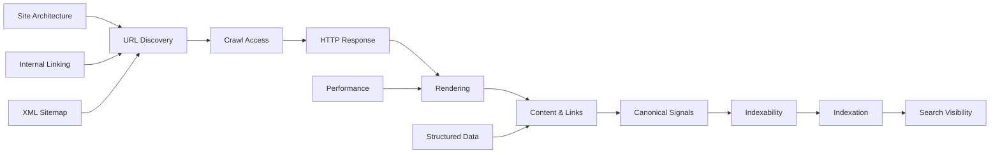
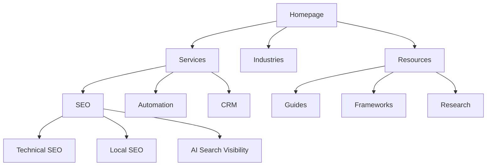

# Technical SEO Audit Framework

### A Practical Framework for Auditing Crawlability, Indexation, Architecture, Rendering, Performance and Search Engine Accessibility

Technical SEO creates the foundation that allows search engines to **discover, crawl, render, understand, index and efficiently revisit** a website.

A technically healthy website does not guarantee rankings, but technical problems can prevent strong content and authority from producing their full value.

This framework is designed to turn a technical SEO audit into a prioritized implementation process rather than a long list of disconnected errors.

> Maintained by [Prashant Rajput](https://github.com/prashant6788)  
> Founder, [Touchstone Infotech](https://www.touchstoneinfotech.com/)

---

## 1. Objective

A technical SEO audit should answer:

- Can search engines discover the important URLs?
- Are important pages allowed to be crawled?
- Can important content be rendered correctly?
- Which URLs are indexable?
- Which URLs are actually indexed?
- Are canonical signals consistent?
- Is the site architecture understandable?
- Are important pages easy to reach internally?
- Are duplicate and low-value URLs controlled?
- Does the website provide a strong mobile experience?
- Are performance problems affecting users or crawling?
- Is structured data implemented correctly?
- Are migrations, redirects and status codes handled safely?
- Are international or multilingual signals correct?
- Can technical problems be prioritized by business impact?

The goal is:

**Discover → Crawl → Render → Understand → Index → Rank → Convert**

---

## 2. Technical SEO Architecture



Technical SEO should support the entire path from discovery to search visibility.

---

# Part I — Audit Setup

## 3. Define Audit Scope

Before crawling the website, document:

- Primary domain
- Important subdomains
- Website platform / CMS
- JavaScript framework if applicable
- Approximate number of URLs
- Important page types
- Target countries
- Target languages
- Recent migrations or redesigns
- Staging environments
- Known technical issues
- Organic traffic trends
- Critical conversion pages

Important page types may include:

```text
Homepage
Service Pages
Product Pages
Category Pages
Location Pages
Blog / Articles
Landing Pages
Documentation
Comparison Pages
Author Pages
Contact / Conversion Pages
```

Not every technical issue has equal business importance.

---

## 4. Establish Baselines

Before making changes, capture a baseline.

Useful sources include:

- Google Search Console
- Web analytics
- Server logs where available
- SEO crawler
- PageSpeed Insights / Lighthouse
- Chrome DevTools
- Rich Results Test
- URL Inspection
- XML sitemaps
- Robots.txt
- CMS configuration

Record baseline metrics such as:

- Indexed pages
- Submitted sitemap URLs
- Organic clicks
- Organic impressions
- Crawl errors
- Core Web Vitals
- Important template performance
- 404 volume
- Redirect chains
- Canonical conflicts
- Structured data errors

---

# Part II — Crawlability & Discovery

## 5. Robots.txt Audit

Review the site's `robots.txt`.

Check:

- Important sections are not accidentally blocked
- CSS and JavaScript required for rendering are accessible
- Staging rules were not copied into production
- Internal search or low-value areas are controlled appropriately
- Sitemap location is included where useful
- Rules are written for the intended crawlers
- Wildcards and path rules behave as expected

Important distinction:

**Blocked from crawling does not necessarily mean removed from the index.**

Use the appropriate indexation control for the intended outcome.

---

## 6. XML Sitemap Audit

A good XML sitemap should primarily contain canonical, indexable URLs that the business wants search engines to discover.

Check:

- Sitemap returns `200`
- XML is valid
- Sitemap is submitted in Search Console
- Important URLs are included
- Redirecting URLs are excluded
- 404/410 URLs are excluded
- `noindex` URLs are excluded
- Non-canonical URLs are excluded
- Parameter duplicates are excluded where appropriate
- Last modification data is accurate if used
- Large sites use sitemap indexes correctly

A sitemap is a discovery signal, not a substitute for good internal linking.

---

## 7. Internal URL Discovery

Important URLs should be discoverable through crawlable internal links.

Check for:

- Orphan pages
- Important pages with very few internal links
- Links created only through JavaScript interactions
- Links hidden behind forms
- Broken navigation links
- Pagination accessibility
- Faceted navigation behavior
- Infinite scroll implementation
- Inconsistent URL formats

A useful question:

> Can a crawler reach every important page through normal internal navigation?

---

## 8. Crawl Depth

Review how many clicks separate important pages from strong entry points such as the homepage or major category pages.

Example:

```text
Homepage
  ↓
Service Category
  ↓
Core Service
  ↓
Supporting Resource
```

Important commercial pages should generally not be buried unnecessarily deep.

Do not optimize click depth mechanically. Prioritize logical architecture and user journeys.

---

# Part III — HTTP Status & URL Health

## 9. Status Code Audit

Review all crawled URLs by response code.

### 200 — Success

Confirm the page genuinely returns useful content.

Watch for soft 404s that technically return `200`.

### 3xx — Redirect

Review:

- Permanent vs temporary redirects
- Redirect chains
- Redirect loops
- Internal links pointing to redirects
- Redirects to irrelevant destinations

### 404 — Not Found

Determine whether the URL:

- Should exist
- Should redirect
- Should remain 404
- Has important backlinks
- Receives traffic
- Is internally linked

### 410 — Gone

Useful where content has intentionally and permanently been removed.

### 5xx — Server Error

Investigate quickly, particularly if important pages or crawlers frequently encounter them.

---

## 10. Redirect Audit

A clean redirect should normally be:

```text
Old URL → Relevant Final URL
```

Avoid:

```text
Old URL → Redirect A → Redirect B → Final URL
```

Review:

- HTTP → HTTPS
- www / non-www consistency
- Trailing slash consistency
- Upper/lowercase behavior where relevant
- Historical URL migrations
- Deleted pages
- Internal links to redirected URLs

Do not redirect every removed page to the homepage.

Redirect only where a relevant replacement exists.

---

## 11. URL Structure

URLs should be stable, understandable and consistent.

Prefer:

```text
/services/technical-seo/
```

over unnecessarily complex structures such as:

```text
/index.php?id=9847&cat=17&type=service
```

Review:

- Unnecessary parameters
- Session IDs
- Tracking parameters
- Case variations
- Duplicate paths
- Date structures
- Excessive folder depth
- Special characters
- URL changes without redirects

Avoid changing established URLs only for cosmetic reasons.

---

# Part IV — Indexability & Indexation

## 12. Meta Robots Audit

Check important pages for:

```html
<meta name="robots" content="noindex">
```

Also review:

- `nofollow`
- `noarchive` where relevant
- `nosnippet`
- `max-snippet`
- `max-image-preview`
- `max-video-preview`

Ensure directives match the intended search behavior.

---

## 13. X-Robots-Tag

Indexation directives may also appear in HTTP headers.

This is particularly relevant for:

- PDFs
- Files
- Dynamically served content
- Non-HTML resources

Audit headers when the HTML source does not explain unexpected indexation behavior.

---

## 14. Canonical Audit

Canonical tags help indicate the preferred URL among duplicate or highly similar pages.

Review:

- Self-referencing canonicals
- Canonicals to redirects
- Canonicals to 404 pages
- Canonicals to `noindex` pages
- Cross-domain canonicals
- Parameter canonicals
- Pagination
- Faceted navigation
- HTTP/HTTPS conflicts
- www/non-www conflicts

Signals should align.

Ideally:

```text
Internal Link
XML Sitemap
Canonical
Redirect Rules
Hreflang
```

should all point toward the intended canonical URL.

---

## 15. Indexation Analysis

Compare:

```text
Crawlable URLs
vs
Indexable URLs
vs
Sitemap URLs
vs
Google Indexed URLs
```

Investigate unexpected differences.

Common categories include:

- Crawled — currently not indexed
- Discovered — currently not indexed
- Duplicate without user-selected canonical
- Alternate page with proper canonical
- Excluded by `noindex`
- Blocked by robots.txt
- Soft 404
- Redirect
- Server error

Do not treat every excluded URL as a problem.

The key question is whether **important URLs are indexed and low-value URLs are controlled**.

---

## 16. Index Bloat

Large numbers of low-value URLs can reduce site quality and crawl efficiency.

Possible sources:

- Internal search results
- Filter combinations
- Tag archives
- Thin taxonomy pages
- Tracking parameters
- Session URLs
- Duplicate product variations
- Calendar pages
- Auto-generated archives
- Empty pages
- Pagination variants

For each pattern, decide whether it should be:

```text
Indexed
Canonicalized
Noindexed
Blocked from Crawl
Consolidated
Redirected
Removed
```

These controls are not interchangeable.

---

# Part V — Site Architecture

## 17. Information Architecture

A clear structure helps users and search systems understand relationships.

Example:



Review whether page hierarchy reflects the actual business and topic relationships.

---

## 18. Internal Linking Audit

Review:

- Orphan URLs
- Pages with weak link equity
- Important pages receiving few links
- Broken links
- Redirecting internal links
- Generic anchor text
- Excessive sitewide links
- Contextual linking
- Breadcrumb links
- Related content modules

Internal links should support both discovery and context.

---

## 19. Pagination

For paginated collections:

- Give each useful page a crawlable URL
- Avoid relying only on JavaScript buttons
- Ensure products/articles remain discoverable
- Avoid automatically canonicalizing every paginated page to page one without a valid reason
- Review whether paginated pages should be indexed based on the use case

Test pagination as a crawler would experience it.

---

## 20. Faceted Navigation

Ecommerce and directory sites can generate enormous URL spaces through filters.

Example:

```text
/shoes/
?color=black
?size=10
?brand=x
?color=black&size=10&brand=x
```

Define which combinations have search value.

Possible controls include:

- Canonicals
- `noindex`
- Crawl controls
- Internal linking rules
- Parameter handling
- Static SEO landing pages

The goal is to preserve useful filtered landing pages without creating uncontrolled crawl spaces.

---

# Part VI — Rendering & JavaScript SEO

## 21. JavaScript Rendering Audit

For JavaScript-heavy websites, compare:

```text
Raw HTML
vs
Rendered DOM
vs
What Search Engines Can Access
```

Check whether critical content requires client-side execution.

Important elements include:

- Main text
- Titles
- Meta tags
- Canonicals
- Internal links
- Structured data
- Product data
- Navigation

Where practical, server-side rendering, static rendering or robust hybrid rendering can reduce dependency on client-side execution.

---

## 22. JavaScript Links

Links should ideally use crawlable anchor elements with valid URLs.

Prefer:

```html
<a href="/technical-seo/">Technical SEO</a>
```

Be cautious when navigation depends only on:

```text
onclick events
JavaScript state
buttons without URLs
client-side actions
```

Test whether important destination URLs can be discovered without user interaction.

---

## 23. Lazy Loading

Lazy loading can improve performance, but important content should remain discoverable.

Review:

- Images
- Product listings
- Articles
- Reviews
- Infinite scroll
- Related content

Ensure loading behavior does not hide important content from crawlers.

---

# Part VII — Mobile & Performance

## 24. Mobile SEO

Audit important templates on mobile.

Check:

- Content parity
- Internal links
- Structured data
- Titles and metadata
- Navigation
- Forms
- Interstitials
- Tap targets
- Viewport configuration
- Mobile page speed

The mobile version should not remove important content that exists on desktop.

---

## 25. Core Web Vitals

Monitor Google's Core Web Vitals using both field and diagnostic data where available.

Key metrics include:

### Largest Contentful Paint (LCP)

Measures loading performance.

### Interaction to Next Paint (INP)

Measures responsiveness to user interactions.

### Cumulative Layout Shift (CLS)

Measures visual stability.

Investigate by template rather than treating every URL independently.

---

## 26. Performance Audit

Review common performance problems:

- Oversized images
- Unoptimized image formats
- Render-blocking resources
- Excessive JavaScript
- Unused CSS
- Third-party scripts
- Slow server response
- Poor caching
- Font loading
- Large DOM
- Heavy tracking scripts

Performance work should focus on real user experience and important templates.

---

# Part VIII — On-Page Technical Elements

## 27. Title Tags

Audit:

- Missing titles
- Duplicate titles
- Extremely long or short titles
- Boilerplate
- Search intent mismatch
- Brand consistency

Titles should describe the page accurately and support search intent.

---

## 28. Meta Descriptions

Meta descriptions are not a direct ranking guarantee, but useful descriptions can improve how pages are presented in search.

Review:

- Missing descriptions
- Duplicates
- Generic templates
- Incorrect page summaries
- Poor commercial messaging

Search engines may generate their own snippets.

---

## 29. Heading Structure

Review:

- Missing primary heading
- Multiple headings used without logical structure
- Headings used only for styling
- Important sections without descriptive headings

The goal is semantic clarity, not mechanically forcing a single heading pattern.

---

## 30. Image SEO

Check:

- Descriptive filenames where practical
- Appropriate `alt` text
- Dimensions
- Compression
- Modern formats where suitable
- Responsive images
- Lazy loading
- Image sitemap where appropriate
- Image URLs accessible to crawlers

Alt text should describe meaningful images for accessibility, not be stuffed with keywords.

---

# Part IX — Structured Data

## 31. Schema Audit

Identify structured data currently deployed.

Common types include:

- Organization
- LocalBusiness
- Product
- Article
- BreadcrumbList
- Event
- VideoObject
- JobPosting
- SoftwareApplication

Review:

- Syntax validity
- Required properties
- Recommended properties
- Content consistency
- Duplicate/conflicting markup
- Template coverage

Structured data must represent visible page content accurately.

---

## 32. Structured Data Architecture

Schema can help make entity relationships explicit.

Example:

```text
Organization
   ↓
Website
   ↓
WebPage
   ↓
Article / Product / Service Context
   ↓
Author / Brand / Breadcrumb Relationships
```

Do not add unsupported claims solely to make schema appear more complete.

---

# Part X — International SEO

## 33. Hreflang Audit

For multilingual or multi-regional websites, review:

- Valid language codes
- Valid region codes
- Return links
- Self references
- Canonical alignment
- Indexability
- Correct destination URLs
- `x-default` where appropriate

Example:

```html
<link rel="alternate" hreflang="en-us" href="https://example.com/us/" />
<link rel="alternate" hreflang="en-gb" href="https://example.com/uk/" />
<link rel="alternate" hreflang="x-default" href="https://example.com/" />
```

Hreflang is not a substitute for localized content.

---

## 34. International Architecture

Common approaches include:

```text
example.com/in/
example.com/us/
example.com/uk/
```

or subdomains / country-code domains depending on business requirements.

Evaluate:

- Maintenance
- Localization
- Authority consolidation
- Hosting
- Legal requirements
- Team capability
- Market strategy

There is no universal architecture for every international business.

---

# Part XI — Ecommerce Technical SEO

## 35. Ecommerce Audit Areas

Review:

- Product URLs
- Category URLs
- Product variants
- Faceted navigation
- Out-of-stock products
- Discontinued products
- Product schema
- Merchant information
- Reviews
- Pagination
- Internal search
- Duplicate descriptions
- Canonicals

---

## 36. Out-of-Stock Products

The correct treatment depends on whether the product will return.

Possible approaches:

```text
Temporarily Out of Stock
→ Keep Page Live + Explain Availability

Permanently Discontinued + Relevant Replacement
→ Consider Redirect

Permanently Discontinued + No Replacement
→ Consider 404 / 410
```

Avoid automatically redirecting every unavailable product to a category or homepage.

---

# Part XII — Local Technical SEO

## 37. Local Business Website Signals

For local businesses, review:

- Business name consistency
- Address
- Phone
- Location pages
- Service areas
- LocalBusiness schema
- Embedded maps where useful
- Google Business Profile landing pages
- Opening hours
- Location-specific content
- Local conversion actions

For multi-location businesses, each legitimate location may require its own useful page.

---

# Part XIII — Security & Protocols

## 38. HTTPS Audit

Check:

- All important pages use HTTPS
- HTTP redirects consistently
- Mixed content
- Internal HTTP links
- Canonical protocol
- Sitemap protocol
- Hreflang protocol
- Certificate validity

Avoid maintaining indexable HTTP and HTTPS versions of the same pages.

---

## 39. Hostname Consistency

Choose the preferred hostname:

```text
https://example.com/
```

or:

```text
https://www.example.com/
```

Then align:

- Redirects
- Internal links
- Canonicals
- XML sitemaps
- Structured data URLs
- Hreflang

---

# Part XIV — Log File Analysis

## 40. Server Log Analysis

For larger or technically complex websites, server logs can show how crawlers actually interact with the site.

Useful questions:

- Which URLs are crawled most?
- Are important pages being revisited?
- Are crawlers wasting time on parameters?
- Are error URLs repeatedly crawled?
- Which bots are accessing the site?
- Are orphan pages being crawled?
- Are redirects consuming crawl activity?

Log analysis is particularly valuable for large ecommerce, marketplace and publishing websites.

---

# Part XV — Migration Audits

## 41. Website Migration Checklist

Before migration:

- Crawl old website
- Export important URLs
- Record rankings and traffic
- Map old URLs to new URLs
- Preserve important content
- Review canonicals
- Prepare redirects
- Validate analytics
- Validate Search Console
- Prepare XML sitemap

After migration:

- Crawl new website
- Test redirects
- Check 404s
- Check robots.txt
- Check `noindex`
- Check canonicals
- Submit sitemap
- Monitor indexation
- Monitor rankings
- Monitor traffic
- Monitor server errors

A migration should be treated as a controlled search-engine transition, not only a design launch.

---

# Part XVI — AI Search Technical Readiness

## 42. Accessibility for AI Discovery

Technical SEO also supports AI-powered discovery systems.

Review whether important information is:

- Publicly accessible
- Available in rendered HTML
- Clearly structured
- Connected through internal links
- Associated with clear entities
- Supported by structured data where appropriate
- Stable at persistent URLs
- Free from unnecessary crawl barriers

Technical accessibility alone does not guarantee AI citations, but inaccessible information is harder to discover and reference.

For a deeper framework, see the [AI Search Visibility Checklist](ai-search-visibility-checklist.md).

---

# Part XVII — Prioritization

## 43. Technical SEO Severity Model

Do not report every issue as equally urgent.

### Critical

Problems that can materially prevent discovery, crawling or indexation.

Examples:

- Production site blocked
- Important sitewide `noindex`
- Major server failures
- Broken migration redirects
- Canonicals removing important sections

### High

Problems likely to materially reduce organic performance.

Examples:

- Important orphan pages
- large duplicate URL patterns
- severe rendering problems
- broken internal linking
- widespread redirect chains

### Medium

Problems worth fixing but unlikely to destroy visibility alone.

Examples:

- Missing metadata at scale
- inconsistent internal redirects
- moderate performance problems
- incomplete structured data

### Low

Cleanup or optimization opportunities with limited expected impact.

---

## 44. Impact vs Effort Matrix

| Impact | Effort | Recommended Action |
|---|---|---|
| High | Low | Fix First |
| High | High | Plan Immediately |
| Medium | Low | Quick Win |
| Medium | High | Schedule |
| Low | Low | Batch Cleanup |
| Low | High | Usually Defer |

Also consider:

- Revenue importance
- Number of affected URLs
- Search demand
- Development dependency
- Risk
- Template-level impact

---

## 45. Audit Issue Template

Every major audit finding should explain:

```text
Issue
↓
Evidence
↓
Affected URLs / Templates
↓
Why It Matters
↓
Recommended Fix
↓
Priority
↓
Owner
↓
Validation Method
```

Example:

```text
Issue:
Service pages are missing from internal navigation.

Evidence:
42 service URLs receive no crawlable internal links.

Impact:
Important commercial pages may be harder to discover and receive less internal authority.

Recommendation:
Add relevant service links from category pages and contextual content.

Priority:
High

Owner:
SEO + Development

Validation:
Re-crawl after deployment and confirm internal link paths.
```

This makes the audit actionable.

---

# Part XVIII — Validation

## 46. Validate Every Major Fix

Technical SEO is not complete when a ticket is marked done.

After implementation:

```text
Fix Deployed
    ↓
Re-Crawl
    ↓
Inspect Source / Rendered Page
    ↓
Test HTTP Response
    ↓
Validate Search Directive
    ↓
Check Search Console
    ↓
Monitor Indexation / Performance
```

Development changes can create unintended technical side effects.

---

## 47. Regression Monitoring

Monitor critical technical signals after major releases.

Useful automated checks may include:

- Robots.txt changes
- Sitemap availability
- Homepage status
- Important page status
- Canonical changes
- `noindex` appearance
- Structured data failures
- Core template changes
- 404 spikes
- Server errors

Technical SEO should include monitoring, not only periodic audits.

---

# Part XIX — Technical SEO Audit Checklist

## 48. 100-Point Technical SEO Checklist

### Crawlability & Discovery

- [ ] 1. Robots.txt is accessible
- [ ] 2. Important sections are not accidentally blocked
- [ ] 3. XML sitemap is accessible
- [ ] 4. XML sitemap is submitted
- [ ] 5. Sitemap contains intended canonical URLs
- [ ] 6. Important pages are internally discoverable
- [ ] 7. Orphan pages are identified
- [ ] 8. Crawl depth is reviewed
- [ ] 9. Pagination is crawlable where needed
- [ ] 10. Faceted navigation is controlled

### HTTP & URLs

- [ ] 11. Important URLs return correct status codes
- [ ] 12. Soft 404s are reviewed
- [ ] 13. Broken internal links are identified
- [ ] 14. Redirect chains are minimized
- [ ] 15. Redirect loops are absent
- [ ] 16. Internal links avoid unnecessary redirects
- [ ] 17. HTTP redirects to HTTPS
- [ ] 18. Preferred hostname is consistent
- [ ] 19. URL parameters are reviewed
- [ ] 20. URL structures are stable and consistent

### Indexability

- [ ] 21. Important pages are indexable
- [ ] 22. Accidental `noindex` is absent
- [ ] 23. X-Robots-Tag is reviewed where relevant
- [ ] 24. Canonicals are present where needed
- [ ] 25. Canonicals point to valid URLs
- [ ] 26. Canonicals do not conflict with redirects
- [ ] 27. Sitemap and canonical signals align
- [ ] 28. Duplicate URL patterns are controlled
- [ ] 29. Low-value indexation is reviewed
- [ ] 30. Search Console indexing reports are reviewed

### Architecture & Internal Linking

- [ ] 31. Site hierarchy is logical
- [ ] 32. Commercial pages receive internal links
- [ ] 33. Important content is not excessively deep
- [ ] 34. Breadcrumbs are reviewed
- [ ] 35. Contextual internal links exist
- [ ] 36. Anchor text is descriptive
- [ ] 37. Navigation links are crawlable
- [ ] 38. Related content systems are reviewed
- [ ] 39. Duplicate navigation paths are controlled
- [ ] 40. Internal link equity supports priority pages

### Rendering & JavaScript

- [ ] 41. Critical content appears in rendered output
- [ ] 42. Important links are discoverable
- [ ] 43. Canonicals render correctly
- [ ] 44. Metadata renders correctly
- [ ] 45. Structured data renders correctly
- [ ] 46. JavaScript errors are reviewed
- [ ] 47. Lazy-loaded content is discoverable
- [ ] 48. Infinite scroll has crawlable URLs where required
- [ ] 49. Client-side navigation is tested
- [ ] 50. Critical resources are not unnecessarily blocked

### Mobile & Performance

- [ ] 51. Mobile content matches important desktop content
- [ ] 52. Mobile navigation is complete
- [ ] 53. Viewport is configured
- [ ] 54. LCP is reviewed
- [ ] 55. INP is reviewed
- [ ] 56. CLS is reviewed
- [ ] 57. Image sizes are optimized
- [ ] 58. JavaScript weight is reviewed
- [ ] 59. Server response is reviewed
- [ ] 60. Third-party scripts are reviewed

### On-Page Technical Elements

- [ ] 61. Important pages have useful titles
- [ ] 62. Duplicate titles are reviewed
- [ ] 63. Meta descriptions are reviewed
- [ ] 64. Primary headings are descriptive
- [ ] 65. Heading hierarchy is logical
- [ ] 66. Images use appropriate alt text
- [ ] 67. Image dimensions are defined where useful
- [ ] 68. Important media is accessible
- [ ] 69. Breadcrumb markup matches visible breadcrumbs
- [ ] 70. Template boilerplate is controlled

### Structured Data

- [ ] 71. Relevant schema types are identified
- [ ] 72. Structured data validates
- [ ] 73. Markup matches visible content
- [ ] 74. Organization data is consistent
- [ ] 75. Product markup is reviewed where relevant
- [ ] 76. Article markup is reviewed where relevant
- [ ] 77. LocalBusiness markup is reviewed where relevant
- [ ] 78. Breadcrumb markup is reviewed
- [ ] 79. Structured data errors are monitored
- [ ] 80. Unsupported or misleading markup is absent

### International / Local / Ecommerce

- [ ] 81. Hreflang is reviewed where applicable
- [ ] 82. Hreflang return links exist
- [ ] 83. Hreflang and canonical signals align
- [ ] 84. Local business information is consistent
- [ ] 85. Location pages are technically accessible
- [ ] 86. Product variants are handled correctly
- [ ] 87. Out-of-stock behavior is defined
- [ ] 88. Ecommerce filters are controlled
- [ ] 89. Product schema is reviewed
- [ ] 90. Merchant/business information is accessible

### Monitoring & Governance

- [ ] 91. Analytics tracking works
- [ ] 92. Search Console is configured
- [ ] 93. Important conversions are tracked
- [ ] 94. Server errors are monitored
- [ ] 95. 404 trends are monitored
- [ ] 96. Major technical changes are documented
- [ ] 97. Migrations have redirect maps
- [ ] 98. Critical SEO directives are regression-tested
- [ ] 99. Fixes are validated after deployment
- [ ] 100. Technical priorities are connected to business impact

---

## 49. Technical SEO Health Model

A useful way to summarize technical health is through five layers.

### Layer 1 — Accessible

Can search systems reach the site and important URLs?

### Layer 2 — Renderable

Can they retrieve and process the important content and links?

### Layer 3 — Indexable

Do technical directives clearly indicate which URLs should be indexed?

### Layer 4 — Understandable

Do architecture, internal links, structured data and page signals make the site understandable?

### Layer 5 — Measurable

Can technical changes be validated against crawling, indexation, visibility and business outcomes?

The model is:

**Accessible → Renderable → Indexable → Understandable → Measurable**

---

## Final Principle

A technical SEO audit should not produce:

> A spreadsheet containing hundreds of errors with no context.

It should produce:

> **A prioritized technical roadmap showing what is preventing search growth, why it matters, how to fix it and how to verify the result.**

Strong technical SEO combines:

**Crawlability + Rendering + Indexation + Architecture + Performance + Structured Data + Monitoring**

---

## Related Resources

### SEO Growth Framework

[SEO Growth Framework](seo-growth-framework.md)

The broader framework connecting technical SEO, search intent, content, authority, AI visibility, conversion and measurement.

### AI Search Visibility Checklist

[AI Search Visibility Checklist](ai-search-visibility-checklist.md)

A practical checklist for evaluating visibility across traditional search and AI-powered discovery experiences.

---

## About the Author

**Prashant Rajput** is the Founder of [Touchstone Infotech](https://www.touchstoneinfotech.com/).

He works across **SEO/GEO, AI, automation, CRM, performance marketing and system integration**, building practical systems that connect visibility, acquisition and revenue operations.

- 13+ years in digital growth and technology
- 300+ businesses supported
- Experience across India, USA, UK, Canada & Australia
- ₹2–3 Cr+ annual media spend managed
- Leading a 26-person growth and technology team

Connect:

- [LinkedIn](https://www.linkedin.com/in/prashant6788/)
- [GitHub](https://github.com/prashant6788)
- [Touchstone Infotech](https://www.touchstoneinfotech.com/)

---

## Contributing

Suggestions, implementation examples and improvements are welcome.

If you have practical experience with crawling, indexation, JavaScript SEO, migrations, ecommerce technical SEO or large-site architecture, consider opening an Issue with observations or proposed improvements.

---

## Disclaimer

This framework is intended for educational and implementation-planning purposes. Search engine documentation, crawler behavior, web standards and platform capabilities change over time. Technical recommendations should be validated for the specific website, CMS, infrastructure and current search-engine guidance.
